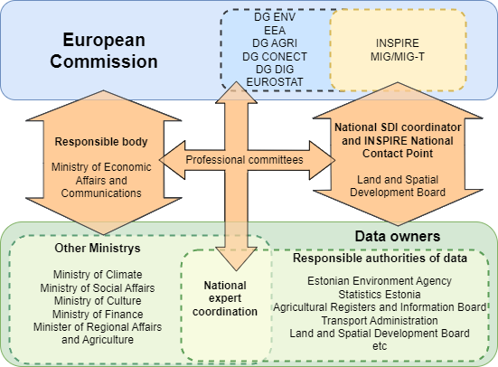

# _EE_ - _2025_: Country Fiche

## Table of Contents
1. [Introduction](#introduction)
1. [State of Play](#state-of-play)
   1. [Coordination](#coordination)
   2. [Functioning and coordination of the infrastructure](#functioning)
   3. [Usage of the infrastructure for spatial information](#usage)
   4. [Data Sharing Arrangements](#data)
   5. [Costs and Benefits](#costs)
1. [Key facts and figures](#key-facts-and-figures)

## Introduction

The INSPIRE Directive sets the minimum conditions for interoperable sharing and exchange of spatial data across Europe as
part of a larger European Interoperability Framework and the e-Government Action Plan that contributes to the Digital Single
Market Agenda. Article 21 of INSPIRE Directive defines the basic principles for monitoring and reporting. More detailed
implementing rules regarding INSPIRE monitoring and reporting have been adopted as Commission Implementing Decision
(EU) 2019/1372 on the 19th August 2019.

This country fiche highlights the progress in the various areas of INSPIRE implementation. It includes information on [monitoring
2024](https://inspire-geoportal.ec.europa.eu/mr/mr2024_details.html?country=ee) acquired in December 2024 and Member States update.

## State of Play

A high-level view on the governance, use and impact of the INSPIRE Directive in Estonia. More detailed information is available
on the INSPIRE knowledge base.

### Coordination

#### National Contact Point

- Name of Public Authority: Estonian Land and Spatial Development Board
- Contact Email: inspire@maaruum.ee
- National INSPIRE Website: [https://geoportaal.ee/](https://geoportaal.ee/)
- MIG Contacts:
   - Contact Person: Mart Randmäe
   - Email: mart.randmae@maaruum.ee
   - Contact Person: Taavi Jakobson
   - Email: taavi.jakobson@maaruum.ee
- MIG T Contacts:
   - Contact Person: Mart Randmäe
   - Email: mart.randmae@maaruum.ee
   - Contact Person: Kaire Veeperv
   - Email: kaire.veeperv@maaruum.ee

#### Coordination Structure & Progress: 

##### Coordination structure
- The Ministry of Regional Development and Agriculture and the Ministry of Economic Affairs and Communications were responsible for the implementation of the INSPIRE Directive in Estonia until 2025. From 2025, the responsible authority will be the Ministry of Economic Affairs and Communications. In accordance with the Spatial Data Act, passed on 28 February 2011, the contact point was also appointed to be the Estonian Land and Spatial Development Board(before 2025 Estonian Land Board).
- The national implementation of the INSPIRE Directive is coordinated by Estonian Land and Spatial Development Board(before 2025 Estonian Land Board) with maintaining national SDI portals like Estonian Geoportal and Estonian Land and Spatial Development Board geoportal. Also providing support and guidance for national data owners. Estonian Land and Spatial Development Board is responsible for data harmonizing and providing Estonian catalog service and most of the INSPIRE valid spatial data services with collaboration Information Technology Centre of the Ministry of the Environment. As INSPIRE coordinator Estonian Land and Spatial Development Board has representatives in MIG and MIG-T.
- In most cases, the Ministries are the data owners by law, but their subdivisions are responsible authorities for the actual data. Ministries have representatives in different committees of European Commission to support understanding political and technical needs of other committees for INSPIRE data. Ministries subdivisions work on a daily basis with Estonian Land and Spatial Development Board technical personnel to support data harmonization to INSPIRE valid data.

Estonian INSPIRE Coordination Structure

   

##### Progress

- In 2020 Estonia went over to new technical SDI strategy using open-source software (GeoServer and GeoNetwork)
for implementing INSPIRE. Estonian Land Board coordinated the change to go over to an open-source software
with the help of Information Technology Centre of the Ministry of the Environment. In 2022, the Estonian
identification system [TARA](https://www.ria.ee/en/state-information-system/electronic-identity-eid-and-trust-services/central-authentication-services) was integrated with GeoNetwork together with a user management system for more
user-friendly secure login of metadata editors. At the end of 2024, a new version of GeoNetwork (4.2.x) was deployed on a new and more stable technical platform.
- To support the data owners and the editors of metadata, the new Estonian Geoportal was released in April 2022
with the help of the Information Technology Center of the Ministry of the Environment. With the creation of the new
Estonian Geoportal, new metadata management rules and, if necessary, new agreements with data owners were
created.
- In cooperation with the Ministry of Economic Affairs and Communications, the Estonian Land Board implemented
automatic metadata sharing with the national open data portal ([Estonian Open Data](https://avaandmed.eesti.ee/)). This makes it possible to
describe INSPIRE and all other public sector spatial data metadata in one portal and one format, but to share it
automatically with users in two portals and formats.
- INSPIRE map application that is in the national technical platform X-GIS, was updated with new INSPIRE data
layers.
- Estonia have covered most of INSPIRE Directive annex III themes with view and download services. In 2021, one
of the priorities was the implementation of INSPIRE Annexes I and II services on the new technical platform. This
priority continued in 2022 as well, and from September 2022 all our services can be found under the
inspire.geoportaal.ee domain. Former Estonian Land Board participated also in the Geo3E project, which resulted in the
creation of the first OGC API Features services on the INSPIRE data model in 2022. Testing took place in 2023 and will continue. The landing page of the Estonian INSPIRE OGC API can be found [here](https://inspire.geoportaal.ee/geoserver/ogc/features/).
- INSPIRE coordinating and technical workgroup was established in 2019 inside Estonian Land Board. It is still
fluently working and supporting INSPIRE spatial data owners.

### Functioning and coordination of the infrastructure 

- The INSPIRE Directive (2007/2/EC) was transposed in Estonia in 2011 by the Spatial Data Act (RT I, 28.02.2011). The
development program of the Ministry of Economic Affairs and Communications defines the development directions of spatial data acquisition, analysis and discoverability until 2025-2028. One of the goals is to meet the objectives of the INSPIRE Directive in a timely manner.
- Estonia has connected their national discovery service to the EU geoportal allowing for the publication of metadata for
available spatial data sets and services on the EU geoportal.
- Estonian Land Board is responsible for maintaining [Estonian Geoportal](https://geoportaal.ee/eng/) (INSPIRE geoportal) and [Estonian Land and Spatial Development Board
geoportal](https://geoportaal.maaamet.ee/eng/) (National SDI that represents through INSPIRE services also INSPIRE data).
- The metadata of all the databases and spatial data services introduced to the Estonian National Geoportal can also be
found through the relevant user interface [https://metadata.geoportaal.ee](https://metadata.geoportaal.ee]).
- More information about Estonian Geoportal can be obtained at [https://geoportaal.ee/eng](https://geoportaal.ee/eng).

### Usage of the infrastructure for spatial information 

The usage of INSPIRE spatial information has been stabilized in couple of years. There are also no significant changes
on comparing Estonian INSPIRE view or download services. One of the main reason could be that the former Estonian Land
Board published in 1 July 2018 most of its spatial data as open data. As most of the Estonian INSPIRE services in 2018
and 2019 were INSPIRE I and II annexes themes and Estonian Land Board was mostly these themes data owner. New
annex III services are also mostly open data and did not make a big new open data releasing effect. Local public sector
preferred to use other possibilities than INSPIRE to collect data.

### Data Sharing Arrangements 

From 2018 the spatial data of the Estonian Land Board is available for free download to everyone. As a result, there is no
need to ask spatial data from Estonian Land Board in a query format. INSPIRE data and services were also directly
affected by this decision and are mostly free of charge. For the conditions of use Estonian Land Board has made their
own [Land Board Open Data License](https://geoportaal.maaamet.ee/docs/Avaandmed/Licence-of-open-data-of-Estonian-Land-Board.pdf).
Environmental spatial data is also mostly free of charge but is not so easily usable for people. To represent spatial location
and basic attributes The Estonian Environment Information Centre has published simple environmental spatial data view
and download services. More detailed information is exchanged with government institutions.
For data exchange between government institutions there is an overall agreement that data exchange is free from charge.

### Costs and Benefits 

Compared to 2022 the costs of 2023 have no significant changes. Implementation of the INSPIRE Directive vary between
actors and are difficult to estimate precisely. Most of the workers in the responsible authorities of INSPIRE data are doing
it as part of their daily job responsibilities and do not get extra benefit for it.
Coordination costs have been the salary costs of two employees in the Estonian Land Board, who coordinate the
entire implementation of the INSPIRE Directive in Estonia. The workload of these two people on INSPIRE topics
corresponds to 0.5 per full-time workload for the whole reporting period. In addition, the Land Board has 3 people
dealing with different INSPIRE topics: communication with information holders, technical advice, participation in
workgroups, metadata filling, monitoring and management, reporting, planning of Estonian geoportal development,
etc. The workload of these people is estimated to be a full-time workload of 2.5 persons for the whole reporting
period.
Information Technology Centre of the Ministry of the Environment has made the salary costs and technical costs in
a value of EUR 90 000. They have 3 workers assigned on INSPIRE whom workload corresponds to 2.5 per full-time
workload for the whole reporting period.
Benefits of 2023 implementing the INSPIRE Directive vary between actors. The monetary value information of the total
benefits is currently unavailable. According to Estonian Land Board INSPIRE workgroup experiences, the key benefits
can be summed up as:
- organizing and re-developing databases has made data (especially environment data) more accessible and clearer
to all users;
- the cooperation between actors have increased (interinstitutional cooperation);
- opportunities to use and implement new technical solutions nationally;
- overall data discoverability and availability increase.

## Key facts and figures

Key facts and figures from monitoring 2023 can be found at [here](https://inspire-geoportal.ec.europa.eu/catalog/views/inspireportal/monitoringreporting/site/mr2023_details.html?country=ee).
