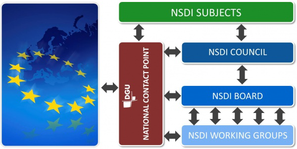

# _HR_ - _2025_: Country Fiche

## Table of Contents
1. [Introduction](#introduction)
1. [State of Play](#state_of_play)
   1. [Coordination](#Coordination)
   2. [Functioning and coordination of the infrastructure](#functioning)
   3. [Usage of the infrastructure for spatial information](#usage)
   4. [Data Sharing Arrangements](#data)
   5. [Costs and Benefits](#costs)

## Introduction

The INSPIRE Directive sets the minimum conditions for interoperable sharing and exchange of spatial data across Europe as
part of a larger European Interoperability Framework and the e-Government Action Plan that contributes to the Digital Single
Market Agenda. Article 21 of [INSPIRE Directive](https://eur-lex.europa.eu/eli/dir/2007/2/oj) defines the basic principles for monitoring and reporting. More detailed
implementing rules regarding INSPIRE monitoring and reporting have been adopted as Commission Implementing Decision
(EU) 2019/1372 on the 19th August 2019.
This Country Fiche highlights Croatia progress in the various areas of INSPIRE implementation. It includes information on
[Monitoring 2024](https://inspire-geoportal.ec.europa.eu/mr/mr2024_details.html?country=hr) acquired in December 2024 and Member States update.

## State of Play

A high-level view on the governance, use and impact of the INSPIRE Directive in Croatia. More detailed information is available
on the [INSPIRE knowledge](https://knowledge-base.inspire.ec.europa.eu/index_en) base.

### Coordination

#### National Contact Point

- Name of Public Authority: State Geodetic Administration
- Postal Address: Gruška 20., 10000 Zagreb, Croatia
- Contact Email: info@dgu.hr; infonipp@dgu.hr
- Telephone Number: +385 (0)1 6165404
- Telefax Number: +385 (0)1 6165484
- National INSPIRE Website: https://www.nipp.hr/
- MIG Contacts: 
  - Contact Person: Ljerka Marić
  - Email: ljerka.maric@dgu.hr
  - Telephone Number: +38516166533
  - Contact Person: Tomislav Ciceli
  - Email: tomislav.ciceli@dgu.hr
- MIG T Contacts: 
  - Contact Person: Tomislav Ciceli
  - Email: tomislav.ciceli@dgu.hr

#### Coordination Structure & Progress: 

##### Coordination structure

The main governing body of NSDI in the Republic of Croatia is the NSDI Council. It is a body that implements the
NSDI within the Republic of Croatia and coordinates the activities of NSDI subjects within the scope and with rights
and obligations determined by the Law on National Spatial data infrastructure (OG 56/13, 52/18, 50/20).

Governmental authorities at the level of ministries mainly join this NSDI Council, but also relevant (branch)
associations as well as National Contact Point (NCP). 

The Act Amending the National Spatial Data Infrastructure Act (OG 50/20) of 2 May 2020 introduced changes in the
composition of the NSDI Council in order to achieve its more efficient work. Therefore it was proposed that the
President of the Council is a representative of the National Contact Point and that a new member from the State
Hydrometeorological Institute is included in the new composition. Additionaly, it governs that exchange and
sharing of data at the national level is regulated by a protocol, whereas the sharing of spatial data between NSDI
entities and European Commission bodies is regulated by an agreement.

At the managerial level is the NSDI Board, a permanent body for NSDI implementation. The NSDI Board
is appointed by the NSDI Council and consists of three representatives from the NSDI Council, three from the NCP,
and the heads of NSDI working groups.

At the operational level, till February 2021, three NSDI working groups were established for the purpose of
elaborating certain tasks and obligations within the scope of the NSDI implementation:
- Workgroup for NSDI technical standards
- Workgroup for NSDI capacity building
- Workgroup for NSDI spatial data.

In 2024, new Working group for spatial plans was established with the aim of making recommendations for registering spatial planning documentation in Croatian NSDI.

The NCP is responsible for leading the implementation of the NSDI and the coordination of the activities of the
NSDI subjects within the scope and with rights and obligations determined by the Law.

##### Progress

As the Republic of Croatia became an official EU member on 1st July 2013, it was not obliged to submit the
INSPIRE monitoring and reporting forms before that date. The first Reporting was submitted in 2016 and progress
has been made since then in many areas. The number of identified spatial datasets and documentation of data
through NSDI geoportal and Metadata Catalogue has grown as well as accessibility of data through network
services and conformity of spatial data sets and services.

In 2024, the fourteenth conference dedicated to spatial data infrastructures, [Days of NSDI 2024](https://www.nipp.hr/default.aspx?id=3807) was organized by NCP as well as two advanced workshops on the topic of raising the quality of metadata and data harmonization for NSDI subjects. In order to help local and regional self-government units, a series of individual meetings were held in 2024 in order to speed up and improve the process of metadata description of spatial data sources in the NSDI Metadata Catalog.

### Functioning and coordination of the infrastructure 

In 2021 the State Geodetic Administration prepared a report on the implementation of measures and activities from the
National Spatial Data Infrastructure Strategy 2020 and the National Spatial Data Infrastructure Strategic Plan for the
period 2017-2020, which was firstly adopted by NSDI Council and after that adopted by the Croatian Government in the
beginning of 2022.
The Act on Amendments to the National Spatial Data Infrastructure Act (OG 50/20) was adopted by the Croatian
Parliament in April 2020. Pursuant to the Act Amending the Act, the current National Spatial Data Infrastructure Act is
harmonized with the INSPIRE Directive, which was amended with the entry into force of Regulation (EU) 2019/1010 of the
European Parliament and of the Council. Also, the composition of the Council of the National Spatial Data Infrastructure is
changed in order to achieve more efficient work of the Council, as well as the competences of the National Contact Point
regarding reporting by Member States to the European Commission. Furthermore, the Act on Amendments to the
National Spatial Data Infrastructure Act (OG 50/20) , with the aim of harmonization with the Law on State Information
Infrastructure (Official Gazette, No. 94/14), proposes that the exchange and sharing of data at the national level is
regulated by a protocol, while the sharing of spatial data between NSDI entities and European Commission bodies is
regulated by an agreement.The Act Amending the National Spatial Data Infrastructure Act (OG 50/20) entered into force
on 2 May 2020.
The Law on Amendments to the Law on National Spatial Data Infrastructure (OG 52/18) was adopted by the Croatian
Parliament in May 2018 and it complies with Directive 2007/2 / EC of the European Parliament and of the Council of
March 14th, 2007 establishing an Infrastructure for Spatial Information in the European Community (INSPIRE).
In September 2017 the government of the Republic of Croatia adopted the Decision on the adoption of the National
Spatial Data Infrastructure Strategy 2020 and the Strategic Plan of the National Spatial Data Infrastructure for the period
2017-2020 (OG 96/17). The adoption of the NSDI Strategy helps all stakeholders, primarily NSDI subjects, to achieve
compliance with the INSPIRE Directive. It further emphasizes the centralized access to spatial data of the public bodies
through the NSDI geoportal, which results in greater efficiency of state administration in areas directly or indirectly linked
to spatial data. Fulfillment of the strategic goals increases the number of spatial data present, primarily at the regional and
local level, where the largest number of new NSDI subjects are expected.
The Law on National Spatial Data Infrastructure (OG 56/13) was adopted by the Croatian Parliament in May 2013.

### Usage of the infrastructure for spatial information 

In order to promote usage of the spatial data among general public in Croatia, State Geodetic Administration developed
spatial data viewer GeoHrvatska that enables users to get to know and explore the surrounding area using official spatial
data through NSDI. Some of the thematic areas that can be explored include environmental quality, land, nature, free
time, protected areas and pollution in the vicinity. During 2022, 24,182 users accessed the GeoHrvatska spatial data
viewer, which represents an increase of 11.47% compared to 2021. Of these, 9.77% are new users and 112,841 pages
were viewed compared to 129,585 from the period of 2021.
Mobile application GeoHrvatska was also developed in 2022 by the State Geodetic Administration with the aim of
promoting and simplification of the use of spatial data by citizens through every day scenarios such as planning of
recreation, trips, exploring land, finding best locations and so on.
Quantitative information about the use of the spatial datasets exists only for those datasets for which are developed
network services.The most used network services are State Geodetic Administration’s Digital orthophoto, Topographic
Map 1: 25 000 and Cadastral parcels and Cadastral municipalities as well as Addresses and Administrative units.
NCP has encouraged NSDI subjects to implement their own metadata catalogues based on NSDI Metadata Specification
and now NSDI geoportal is harvesting two such catalogues from the Ministry of Economy and Sustainable Development
and Croatian Bureau of Statistics.
The use of the infrastructure for spatial information has grown in previous years which can be seen from larger numbers of
access to NSDI geoportal for more than 30%.
NSDI is also used in education in the Republic of Croatia. Research made on several high schools and universities in
Croatia showed that NSDI is used for educational purposes in at least 3 faculties and 1 high school.
State Geodetic Administration, from 2019 to 2021 was implementing the project "Strengthening Capacities for the
Establishment of the National Spatial Data Infrastructure". The project was co-financed by the European Social Fund from
the Priority Axis 4, Operational Program Effective Human Resources 2014-2020, Investment Priority 11.i., Specific goal
11.i.1. The main goal of the project was to strengthen the existing NSDI capacities at the National Contact Point and local
promoters, as well as to raise NSDI knowledge at the local, regional and national levels thus resulting in the increase of
the number of NSDI subjects. In scope of project, during 2021, 11 workshops were organised primary for representatives
from local government. As part of the project, in 2021 the State Geodetic Administration published the brochure "Spatial
Data and NSDI for Connected Croatia" and the publication "National Spatial Data Infrastructure in Implementation"
intended for NSDI subjects and all other users of spatial data.
State Geodetic Administration, from 2019 to 2021, was implementing the project „Increasing the availability of NSDI
spatial data through e-services“ funded from the European Regional Development Fund, aiming to increase availability
and interoperability of spatial datasets in Croatia. In scope of project, the module "Example of good practice for the use of
NSDI spatial data" was developed and it is publically available as a part of the NSDI Geoportal browser.
In 2020, new version of NSDI Metadata Specification was implemented to the national catalogue on the national
Geoportal.
At the end of 2019, a new version of the NSDI Metadata Specification, that is fully compliant with the new INSPIRE
Implementing rules for metadata “Technical Guidance for the implementation of INSPIRE dataset and service metadata
based on ISO/TS 19139:2007 ", was adopted. In the Specification the emphasis is on implementation rules of xml coding
of metadata elements in accordance with norm ISO / TS 19139: 2007 taken as a reference, international standard for
metadata coding. New Specification, in which metadata elements are divided into compliance classes, provide better
support in automatic metadata validation.
Communication Plan of National Spatial Data Infrastructure was written in December 2018 and its goal is to define the
best methods for communication with different stakeholders including the general public and further raise the awareness
on benefits of spatial data infrastructure.

### Data Sharing Arrangements 

The goal of Croatian SDI is to share the data between public authorities and to re-use it for different purposes. Data
sharing agreements exist among public authorities and define the terms of use for datasets that are being
shared, therefore reducing the obstacles in data sharing. Since 2020, when the Act on Amendments to the National
Spatial Data Infrastructure Act (OG 50/20) came into force, the exchange and sharing of data at the national level has
been regulated only by a technical document –protocol, what means that formal agreements are no longer required.
There is also a practice of co-financing the major projects of data acquisition between two or more institutions that also
leads to data sharing and cost reduction. The best example is the creation of Digital orthophoto, which is co-financed by
two institutions, State Geodetic Administration and Agency for Payments in Agriculture, Fisheries and Rural
Development. Another example is the project “ Multisensor aerial survey of the Republic of Croatia ” implemented by the
Ministry of Economy and Sustainable Development, State Geodetic Administration and Croatian Waters.
Data exchange and sharing are common among most Croatian public authorities and European Community institutions
and bodies. For example, the Meteorological and Hydrological Service exchange daily data in the context of the European
Flood Awareness System and World meteorological services. State Geodetic Administration provides data for European
Environment Agency and Eurostat.
The data under the responsibility of the State Geodetic Administration are the most shared data between public
institutions, so that at the end of 2022 the data were shared/exchanges with 120 public institutions. In 2022, Law on State
Survey and Real Estate Cadastre was amended to stipulate that the use of network services is free of charge for all data
under the State Geodetic Administration’s responsibility.
The State Geodetic Administration, in 2019, has signed the Copernicus Agreement with the European Environmental
Agency which includes ATOM INSPIRE - Administrative units, Hydrography and Elevation. In 2022 the State Geodetic
Administration has signed Agreement on the use of official spatial data sets with Eurostat, providing INSPIRE -
Addresses, Buildings, Cadastral Parcels, Administrative units, Transport networks and Orthoimagery.

### Costs and Benefits 

Benefits:

Although no quantitative values of the INSPIRE implementation benefits can be given, there are many positive feedbacks to
INSPIRE implementation and using National Spatial Data Infrastructure:
Using NSDI has led to cost reduction as data can be re-used in other institutions and duplication of data acquisition can
be avoided.
Stakeholders use the Metadata Catalogue and NSDI geoportal for their needs regarding spatial data since all necessary
information regarding the data can be found there (e.g. terms of use, resolution, data coverage).
NSDI subjects when providing INSPIRE services for their spatial datasets decide to make them free of charge, thus
allowing companies to use these data to create new products and expand the spatial data market.
Generally, NSDI is contributing a lot in raising knowledge on spatial data management issues.

Costs:

According to the report on the implementation of measures and activities from the National Spatial Data Infrastructure Strategy
2020 and the National Spatial Data Infrastructure Strategic Plan for the period 2017-2020 overall costs for was 10 814 566
Euros divided in 7. Strategic goals. Implementation costs for each of the strategic goal were:
Strategic goal no. 1: NSDI is known and the benefits it brings
The cost in this strategic goal during the period 2017 - 2020 amounts to 51 188 euros and mainly refers to participation in
workshops and conferences and implementation of spatial data portals of some NSDI subjects.
Strategic goal no. 2: Spatial data and services are available and meet the needs of users
The cost in this strategic goal during the period 2017 - 2020 amounts to 4 614 244 euros and it refers to the development of
network services (view and download).
Strategic goal no. 3: Terms and fees for the use of spatial data are easy to understand
The cost in this strategic goal during the period 2017 - 2020 amounts to 12 088 euros and it refers to development of standard
licenses (open and special) for spatial data and workshop on licensing of data.
Strategic goal no. 5: There are sufficient operational options available for the effective and efficient use of the NSDI
The cost in this strategic goal during the period 2017 - 2020 amounts to 5 766 823 euros and it refers to all the projects aiming to
implementation and development of NSDI in Croatia, co-financed from EU funds, especially of those in which information
systems and INSPIRE network services have been developed.
Strategic goal no. 6: NSDI supports other important policies and programs at the national and international level
This strategic goal refers to compliance to INSPIRE of datasets, network services and metadata and the cost in this strategic
goal during the period 2017 - 2020 amounts to 166 750 euros.
Strategic goal no. 7: NSDI stakeholders (NSDI entities and beneficiaries) cooperate through partnerships and other types
of agreements
This strategic goal refers to concluding cooperation agreements and inclusion of NSDI subjects and their metadata in the
Catalog of Metadata on the NSDI Geoportal and the cost during the period 2017 - 2020 amounts to 203 473 euros.
