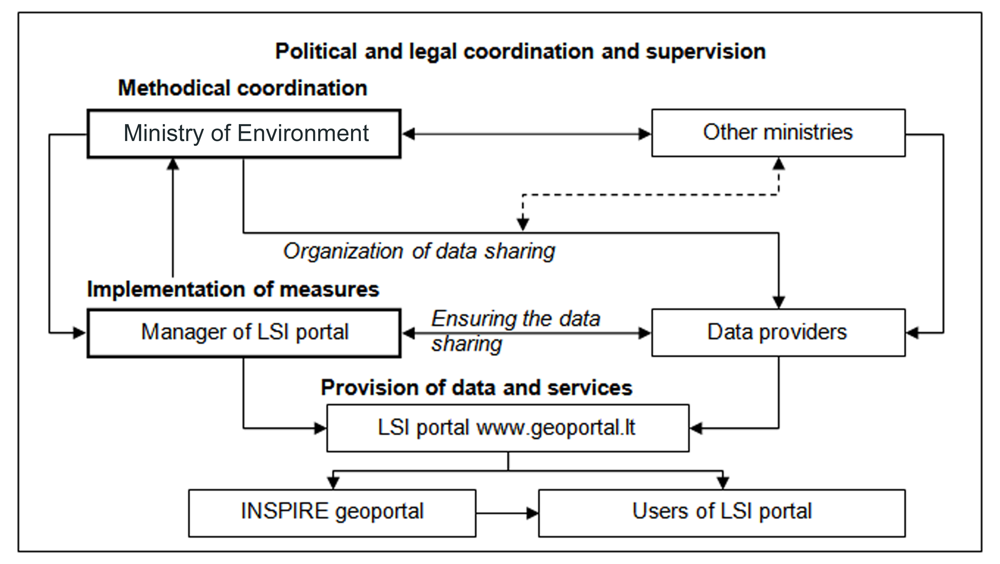

# _LT_ - _2024_: Country Fiche

## Table of Contents
1. [Introduction](#introduction)
1. [State of Play](#state_of_play)
   1. [Coordination](#Coordination)
   2. [Functioning and coordination of the infrastructure](#functioning)
   3. [Usage of the infrastructure for spatial information](#usage)
   4. [Data Sharing Arrangements](#data)
   5. [Costs and Benefits](#costs)

## Introduction

This country fiche highlights Lithuania’s progress in the various areas of INSPIRE implementation. It contains information covering the period **up to March 2024**.

Lithuania has transposed the INSPIRE Directive into national law by adopting amendments to the Law on Geodesy and Cartography (https://e-tar.lt/portal/lt/legalAct/TAR.EFE69222D6BC/asr). 

This law defines the Lithuanian spatial information infrastructure. Centralised spatial data sharing tools have been established on the Lithuanian Spatial Information Portal https://www.geoportal.lt/.  The content of the Lithuanian Spatial Information Portal is available in Lithuanian and English.  

The Lithuanian responsible authorities shall ensure the provision of spatial data sets included in the list approved by the Resolution of the Government of the Republic of Lithuania No 1460 of 13 October 2010 "On the approval of the spatial data themes of the Lithuanian Spatial Information Infrastructure" (https://e-tar.lt/portal/lt/legalAct/TAR.63D65F3568A2/asr) as well as of their metadata, to the INSPIRE geoportal of the European Commission (https://inspire-geoportal.ec.europa.eu);
Lithuania ensures the functioning of the Lithuanian Spatial Information Infrastructure tools and provision of spatial data and services to the INSPIRE geoportal in Lithuania. The national INSPIRE data system is accessible at: https://www.inspire-geoportal.lt/geonetwork/srv/eng/catalog.search#/home.

## State of Play

The following paragraphs provide a summary of currently valid information on governance, use, impacts and progress achieved towards INSPIRE implementation in Lithuania.

### Coordination

#### National Contact Point

- Name of Public Authority: Ministry of Environment of the Republic of Lithuania
- Postal Address: A. Jakšto g. 4, 01105 Vilnius, Lithuania
- Contact Email: info@am.lt
- Telephone Number:+ 370 669 52682
- Telefax Number:
- National INSPIRE Website:https://www.inspire-geoportal.lt/geonetwork/srv
- MIG Contacts: 
  - Contact Person: Aušra Kalantaitė
  - Email: ausra.kalantaite@am.lt
  - Telephone Number:+370 669 52682
  - Contact Person: Saulius Urbanas
  - Email: saulius.urbanas@am.lt
- MIG T Contacts: 
  - Contact Person: Aurelija Šturaitė
  - Email: aurelija.sturaite@ssva.lt
  - Contact Person: Inga Andriuškevičiūtė
  - Email: inga.andriuskeviciute@ssva.lt
  - Telephone Number: +370 700 15100
 
  #### Coordination Structure & Progress: 

##### Coordination structure

Since 03-01-2023 the Ministry of the Environment is the designated governmental authority, responsible for the implementation of the INSPIRE Directive in the Republic of Lithuania (Ministry of Agriculture co-ordinated INSPIRE activities by 03-01-2023.). Ministry of Environment is responsible for the development of SDI measures to ensure operational capacities of metadata, data sets, network services, sharing services for the themes referred in the Annexes of the Directive. It also maintains the link to the INSPIRE portal. 

Ministry of Environment is responsible for:
- acting as a governmental representative in the INSPIRE Committee;
- monitoring the establishment and use of the spatial data infrastructure in Lithuania;
  - submitting reports on the implementation of the Directive in Lithuania to European Commission.

The Law on Geodesy and Cartography of the Republic of Lithuania is the principal law transposing the Directive to national legal framework in the Republic of Lithuania. Detailed requirements for the implementation of the INSPIRE Directive are laid down in Government Decrees of the Republic of Lithuania, Orders of the Minister of the Environment and other subordinate legal acts.

The Resolution of Lithuanian Government of 13 October, 2010, No. 1460 and its amendments (the latest amendment of 5 February 2025, https://e-tar.lt/portal/lt/legalAct/92867760e90c11ef8bf78f8ccc0e0474) sets the list of the datasets corresponding to Annexes of the Directive, which  shall be provided to users within Lithuanian spatial information infrastructure.

Lithuanian Spatial Information portal (LSI portal, www.geoportal.lt) is the main technological platform  implementing the provisions of the Directive. It provides the single national access point to spatial data and services. It is the primary source of national spatial data and services to the INSPIRE geoportal.

The operating (technical) manager of the LSI portal is Public Enterprise “Construction Sector Development Agency” (hereinafter CSDA). CSDA is responsible for:
- management of the systems of the LSI portal and ensuring a continuous operation of the services;
- content administration of the LSI portal;
- collection, arrangement and management of metadata;
- development and maintenance of the LSI portal web services;
- management of data license agreements;
- monitoring of the provision of spatial data and services;
- support and consultation of LSI portal users and data providers;
- ensuring security of LSI portal information;
- provision of spatial data and services to the INSPIRE geoportal.

The data providers are the state and municipal authorities and other legal persons, responsible for creation and management of spatial datasets. Any data provider (state or commercial, NGOs or physical persons) can share their spatial data in the LSI portal free of charge if the data are considered being valuable for the society.

In accordance to the procedure and under the conditions laid down by the Law on Geodesy and Cartography and the LSI Portal Regulation, the manager of the LSI portal maintains data provision agreements with the LSI portal spatial data providers.

Provision of spatial data and services to the INSPIRE geoportal is also regulated by data provision agreements. Data providers are responsible for transformations of spatial data according to the INSPIRE data specifications.  LSI portal manager is responsible for creating INSPIRE compliant metadata and network services of the datasets. LSI portal manager provides regular consultations on LSI portal benefits and organizes trainings on proper provision. 
Users of the services of the LSI portal are physical and legal persons who use the data of the LSI portal, spatial data sets and their metadata through the spatial data services and interactive e-services of the LSI portal.

##### Progress

Since 2022, two major reorganizations of the LSI portal operator took place. On January 3, 2023, a new state enterprise "Agricultural Data Center" (ADC) was established, merging three state enterprises, including the former operator of the LSI portal state enterprise "GIS-Centras". After the fusion the responsibilities on maintenance of LSI portal were carried out by the Spatial Information Department within the ADC. In January 2024, the Spatial Information Department was moved and merged into another organization – public enterprise "Construction Sector Development Agency", supervised by the Ministry of Environment.

The second restructuring has improved the situation, as the current enterprise is managed entirely by the Ministry of the Environment. However, with this restructuring, the overall strategic direction of improving the efficiency of the construction sector has been launched, which poses new challenges in terms of the need for spatial data.

The war in Ukraine, the global political situation and national security issues are driving the search for solutions to protect sensitive spatial data from hostile countries.  Every effort is being made to strike a balance between maximum data openness and data protection.

The technological solution for provision of INSPIRE data is based on Geonetwork platform. Hale studio is used to analyse, transform and validate INSPIRE data sets. Various commercial software is used for partial data processing tasks. 

Some separate datasets within one INSPIRE theme have been combined into one dataset. Although the total number of datasets was thus reduced, we believe that this approach is more efficient and more convenient for the users. Interactive services of the LSI portal have been improved and extended. The functionality, including usage by mobile devices, was improved. 

Currently, the operator of the Lithuanian geoportal provides the necessary internal resources and competences for the implementation of INSPIRE in Lithuania. All INSPIRE network services are maintained and updated. Lithuania still stands out among other EU Member States in terms of the relative volume of dataset download services, which is 100%. There are still some uncertainties about priority datasets that have not been transformed according to the requirements of the INSPIRE data themes. While these datasets are undoubtedly valuable and must be provided, their provision worsens some formal country indicators.
The European Commission has adopted a Commission Implementing Regulation (https://eur-lex.europa.eu/legal-content/LT/TXT/?uri=CELEX:32023R0138) implementing Article 14(1) of Directive (EU) 2019/1024 of the European Parliament and of the Council of 20 June 2019 on open data and the re-use of public sector information, which establishes a list of specific high-value datasets and the procedures for the preparation, publication and re-use of the high-value data contained in it. The Implementing Regulation entered into force on 9 February 2023. The spatial datasets submitted to the EU INSPIRE geoportal represent a significant part of the Lithuanian High Value Datasets (HVDs) that need to be opened. There is an ongoing debate on whether the data available in the EU INSPIRE geoportal can be considered open at European level, and on the relationship between the Lithuanian Open Data Portal and the Lithuanian Spatial Information Portal – where organisations should submit open spatial data to avoid duplication. There are also differences in the treatment of open, spatial and high-value data in different areas managed by different institutions. We draw attention to the need for an inter-institutional spatial data policy and the need for unified coordination of data sharing. 

### Functioning and coordination of the infrastructure 

-	In Lithuania, national spatial data infrastructure is centralised and accessible via national LSI portal: https://www.geoportal.lt/.  The objective of the LSI portal is to facilitate a centralised access to spatial data sets, web services and their metadata. The LSI portal allows an integration of public sector spatial information (state and municipal organisations), data from state registers and information systems, and important spatial information from other sources (business, NGO, research and education etc.).
-	There is a list of organizations and spatial data sets that these organizations must provide, regulated by the Resolution of Lithuanian Government of 13 October, 2010, No. 1460 (https://e-tar.lt/portal/lt/legalAct/92867760e90c11ef8bf78f8ccc0e0474). Other data providers may do so voluntarily. Provision of original spatial data is subject to spatial data provision agreements, maintained by the LSI operator. Some of the open data required for INSPIRE themes are not included in the data provision agreements. Their updating and transformation is the responsibility of the LSI portal operator. In January 2025, there were 56 spatial data providers of ca. 400 individual spatial data sets.
-	The main public spatial data providers are national agencies such as Centre of Registers, Centre for Agricultural Data, Construction Sector Development Agency, Environmental Protection Agency, Department of Cultural Heritage, Lithuanian Geological Survey Service, Lithuanian Hydrometeorological Service, National Land Service, State Forest Survey Service, State Territorial Planning and Construction Inspectorate. 
-	There are 60 municipalities that have spatial information systems and some – local infrastructures at very different level of development. Spatial data of Lithuanian municipalities are provided in LSI portal as integral parts of national datasets or, in specific cases, individually by the municipalities. 
-	LSI portal operator provides all INSPIRE data to the INSPIRE geoportal. LSI portal operator offers several versions of basemaps, API’s for place name search, free consulting and ample technical support for the spatial data providers. 
-	Policy group for Cadastre and Spatial Data at the Ministry of Environment ensures inter-institutional coordination of activities related to the implementation of the INSPIRE Directive and secures the necessary legal framework.
-	The network services of the LSI portal are publicly accessible at www.geoportal.lt:  in Lithuanian and English user interfaces. Data and services for INSPIRE themes are accessible at https://www.inspire-geoportal.lt/geonetwork/srv/eng/catalog.search#/home. In addition, 80 priority data sets that are not in any data theme are available at https://inspire-geoportal.ec.europa.eu/srv/eng/catalog.search#/results?country=lt&view=priorityOverview&theme=none&iacs=none&legislation=none&envdomain=none&basedomain=0

### Usage of the infrastructure for spatial information 

-	The major part of data and services at the LSI portal are provided free of charge under CC BY 4.0 open licence. Previous variety of specific agreements on data use has been replaced by General conditions for data use (https://www.geoportal.lt/geoportal/en/web/en/general-conditions-for-the-use-of-spatial-data) to which all users of geoportal.lt must agree. 
-	There are some datasets that can only be accessed by registered and authenticated users, and some datasets that are provided for non-commercial purposes only. But in general, since 2022 the conditions for accessing spatial data have become much simpler for users.
-	In January 2025, the LSI portal has ca. 25,000 registered users, which are mainly GIS professionals in different areas. The most of spatial data services are accessible without registrations. Overall yearly number of spatial data requests is about 4 million.  Of them, INSPIRE view services comprise ca. 0.5 million (INSPIRE download services aren’t monitored). 
-	More and more users are using the portal's mobile app. There is a trend towards an increasing number of devices per user with the mobile app installed. In view of these statistics and the comments made by users, we recommend, as before, to consider the creation of an iOS version – in January 2025 – ca. 47,000 users with ca. 96,000 devices. Generally, almost 1% of Lithuanian population are LSI portal users.  
-	The usage of the Lithuanian Spatial Infrastructure had slowed down since 2018 and was 3 to 5 % yearly, depending on indicator, till 2022. At the end of 2022 total number of provided services reached 3,6 million and the number of registered users exceeded 22 000. As a result of the war in Ukraine in 2022 due the temporal restriction to spatial data referred to a potential threat to public security and national defense, the data use in LSI portal slowed down. The growth momentum was regained in 2023 and reached 7%. Explosive growth of 83% was observed in 2024 due to new ortophotographic maps published after some delay. 
-	About 40 % of users are from the non-governmental sector. Research and academic organisations comprise about 10% of registered users, business about 30% of registered users.
-	The data and web services of the LSI portal have contributed to increasing the competence and knowledge of spatial data users. Users more often make decisions and solve business problems using spatial information, especially in spatial planning. Such tendencies have been observed in the LSI portal by the increased use of appliedweb services and more comprehensive nature of queries and user requests.
-	The LSI platform allows Lithuanian public administration bodies to work more efficiently. Specific legislations in the INSPIRE themes related activities demand authorities in providing spatial data to the LSI portal and public services, help increasing quality of reports, increase and better visualised argumentation for decisions making or public consultation activities. 
-	Providers of spatial information services are more interested in utilizing the LSI webservices than creating own webservices. Lithuanian public administration bodies still lack competence and human resources to make best use of the infrastructure. Continuous training and user consultation on optimal use of LSI portal tools and operational capacities of spatial data is needed. 
-	The LSI data services are particularly important to municipal and state authorities which have limited resources, but shall perform public administration tasks applying spatial data (e.g., to check out the specific location and grant an authorisation for cutting down a tree or to measure a distance to river or lake). Spatial data, provided by the LSI portal facilitate in solving various analytical issues, contributing to improve workloads and adding an extra value in various information systems.
-	An electronic survey of geoportal.lt users was carried out from 05-04-2023 to 15-04-2023. The average rating of the portal's services is very high – 82.8 out of 100.
