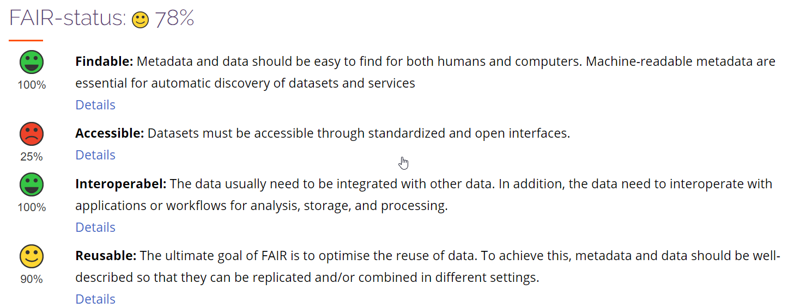

# _NO_ - _2024_: Country Fiche

## Table of Contents
1. [Introduction](#introduction)
1. [State of Play](#state_of_play)
   1. [Coordination](#Coordination)
   2. [Functioning and coordination of the infrastructure](#functioning)
   3. [Usage of the infrastructure for spatial information](#usage)
   4. [Data Sharing Arrangements](#data)
   5. [Costs and Benefits](#costs)

## Introduction

The Norwegian Mapping Authority is responsible for the coordination of the Spatial Data Infrastructure (NSDI) in Norway. The authority has the responsibility for the monitoring and reporting of the INSPIRE directive and holds the role as the Norwegian National Contact Point. 

## State of Play

The Norwegian NSDI cooperation "Norway Digital" was established in 2005. The cooperation now comprises more than 500 parties, including about 50 governmental authorities and ministries with interest in spatial data management, all municipalities (more than 350), all county administrations and 130 electricity and other utility companies. The participation of each party is formalised by means of an agreement. The Norwegian NSDI has a broad representation from different sector organisations.

The Ministry of Local Government and Regional Development recommends and mandates Norway Digital to coordinate actions by the parties to fulfil requirements defined in the Norwegian Geodata act (2010). The Geodata act and bylaws implements the INSPIRE directive in Norwegian law in accordance with the EEA Agreement, cf. point 1j in Chapter I of Annex XX of the Agreement. The Agreement applies a somewhat different implementation timetable for the EEA-EFTA member states. Hence the deadline for Norway on data harmonization is 2020 for Annex I data and 2023 for Annex II and III data.

“Norway Digital” is the focal point for the INSPIRE implementation. The INSPIRE implementation efforts have in the recent years mainly focused on the identification, description and tagging of as-is INSPIRE datasets, and progress has been good.

These data are of high-quality and are being used in everyday digital workflows in municipalities, county administrations, national authorities and the private sector. Most of the data are harmonized according to national data specifications, adapted to the national legislation and everyday work in most sector activities, e.g. roads and rail management, crisis management, environmental management at all levels, land use and city planning, coastal zone management, fisheries, agriculture, defence and security. The Norwegian as-is data aims to follow major INSPIRE regulations, such as data sharing principles and accessibility of network services etc. The quality of data content has increased steadily the last years, as has the use in digital processes. Data and services are well documented with metadata following the INSPIRE principles. The Norwegian implementation may be seen as a model for integration of INSPIRE spatial data infrastructure into the digital economy and digital public workflows. 

Concerning INSPIRE harmonization requirement, INSPIRE progress is lower. Norway has pr. 1.1.2023 eleven harmonized datasets available in the INSPIRE geoportal, covering Annex I data themes. Concerning Annex II and III themes, the formal requirement for Norway was to deliver these by end 2023. A number of organisations have still not given priority to develop harmonised data for data sets falling under Annex II and III. 

Many organisations offer sector specific data. 19 organisations offer data that falls under the INSPIRE directive thematic focus.
  
The data content that is delivered generally holds a very high quality, with a high level of detail and accuracy. Many of the Norwegian INSPIRE data services are incorporating or based on detailed data from locally organised data capture. Many of the themes also have a reasonable to high updating frequency.

### Coordination

#### National Contact Point

- Name of Public Authority: Kartverket
- Postal Address: Postboks 600 Sentrum, 3507 Hønefoss
- Contact Email: post@kartverket.no
- Telephone Number: +47 32 11 80 00
- National INSPIRE Website: [http://www.kartverket.no](http://www.kartverket.no)
- MIG Contacts: 
  - Contact Person: Dag Høgvard
  - Email:dag.hogvard@kmd.dep.no
  - Contact Person: Arvid Lillethun
  - Email: Arvid.Lillethun@kartverket.no
- MIG T Contacts: 
  - Contact Person: Morten Borrebæk 
  - Email: morten.borrebaek@kartverket.no
  - Contact Person: Lars-Inge Arnevik
  - Email: lars-inge.arnevik@kartverket.no
 
#### Coordination Structure & Progress: 

##### Coordination structure

The Norwegian Mapping Authority is responsible for the coordination of the Spatial Data Infrastructure (NSDI) in Norway. The authority has the responsibility for the monitoring and reporting of the INSPIRE directive, and holds the role as the Norwegian National Contact Point. Responsible ministry is Ministry of Local Government and Regional Development.

The Ministry of Local Government and Regional Development has set a National geodata advisory board, giving high level advice to the ministry. 

Both public and private organisations are represented. There is an operative National geodata coordinating committee, as defined in regulation under the geodata act. The latter works on strategic directions, coordinates action and gives advice to the Norwegian Mapping Authority as national coordinator of the spatial data infrastructure. Representatives cover national agencies under each ministry, together with municipality and county representatives. There are underlying technical and thematic working groups.

##### Progress

The INSPIRE directive and underlying regulations define a series of requirements. Norway has a dedicated work on delivering according to the requirements. There is a good overall response on data sharing. The number of services has increased the last years.  However, in some cases the linkage from the datasets associated services, are not visible, as it is not according to the guidelines. There are plans to improve the linkage in 2024.      

Besides this, the development towards all technical requirements is relatively low - particularly when it comes to conformity of services. This may be seen in several validation services offered by the European Commission. Some of the validation errors are also caused by our open-source software and hard to get rid of. We are also questioning the need of tests that don’t deal with interoperability issues, and only reports errors related to wrong user input. Such errors could give a warning but no error report, and the validation could pass.

We have improved the conformance of metadata significantily the last years, but we didn't put to much effort into this in 2023. Hopefully we can take a new step towards full metadata conformance in 2024. 

**Delivery of priority environmental reporting data:** 
EU Commission has defined certain Inspire data sets to be of high priority. A sub-group under the Maintenance and Implementation Work Programme 2017-2020 has developed a list of datasets related to environmental reporting (PDS). 
The list defines approximately 90 dataset. Approximately 45-55 of these are relevant for Norway. So far, the Norway has established 15 dataset with metadata and as-is view-services. This number corresponds to 28 datasets in the list. 
Download services according to Inspire-standards (WFS and Atom) are not established, and there are technical issues regarding linking between metadata and services that needs to be sorted out. 

**Inspire and HVD:** 
There are ongoing processes concerning the implementation of the Open data directive (ODD) and high-value datasets (HVD) in Norway. The implementation into national law is planned to be carried out in the coming years as part of the EEA (European Economic Area agreement) agreements. The national INSPIRE community has started to see how implementation of the two legal acts can get a coordinated implementation at technical level. There are also discussions on how to implement the “free of charge”- requirement in HVD which is not a requirement in INSPIRE, as less income may affect data quality negatively. 

**Data to Eurostat, EU Commission Services, EEA, Copernicus:** 
The Norwegian Inspire data sets are to serve EU bodies and communities, such as Eurostat, EU Commission Services, European Environment Agency (EEA) and Copernicus services, particularly the Copernicus in-situ (Corda) system. Their signals about priority Inspire data are valuable, as efforts then may focus on covering priority needs with these bodies and communities. In this work Norway will have a particular focus on delivering data that fulfils user requirements, e.g. on data quality. 

**National geospatial strategy and action plan:** 
A National Geodata Strategy was launched in late 2018 and lasts to 2025. In this strategy the government sets an aim to boost the use of spatial data in the Norwegian society, in order fulfil the UN sustainability goals, boost economy and develop an effective and wellfunctioning public sector. There is a specific focus on developing quality data, with full coverage, up to date information, and accurate localization. User assessment show that data quality is too low to fulfil the existing and planned user needs. An action plan has been developed, e.g. on geoportal developments. 

### Functioning and coordination of the infrastructure 

The INSPIRE infrastructure is not seen as an independent infrastructure but as a part of the national spatial data infrastructure. 

The implementation is also linked to elements of the national general digitization policy and infrastructure – constituting the Digital-agenda-implementation. 

At national level there is a close follow up of the different stakeholders. Stakeholders are active, delivering according to the INSPIRE technical requirements where these corresponds the national needs, e.g. sharing data openly and establishing metadata, view services and download services. There is relatively low interest in implementing INSPIRE harmonized data. 

The data content being offered is mostly high-quality data. One important initiative in the NSDI is the management of a joint geospatial database with a common set of fundamental geospatial data. Data capture and management is being organized by a joint investment program, «Geovekst», lasting for more than 25 years. Most municipalities, roads administration, agricultural sector, energy sector and the mapping authority are parties in the joint program. Recently a national central synchronization service technology has been adopted by a high number of municipalities as part of the joint program. This is an important innovation step allowing data to be continuously being updated in a central database and servicing these most important data as up to date data to the users. Previously, this was a manual process, with updating 1-2 times per year. 

### Usage of the infrastructure for spatial information 
Usage of the infrastructure for spatial information The Norwegian geoportal holds a central place in the Norwegian infrastructure. It contains metadata for all datasets and services falling under the INSPIRE directive, as well as other geodata. The portal is free for all to use as a metadata management system and as a discovery service. The portal is developed and maintained by the Norwegian Mapping Authority. 

The geoportal [https://www.geonorge.no](https://www.geonorge.no) is a web site but in addition it contains a series of tools and api’s- central processing functionalities for data file production, web service production, register management etc. It is becoming an increasingly important element in the general public sector digitalization infrastructure. 

Data are available as downloadable files in different formats, e.g. GML, FGDB and postgis, together with the national format SOSI. Most data sets have corresponding view and download services. The last years there has been a rapid increase in the development of download services being offered through the national geoportal (WFS, Atom Feed, Geonorge download API). Pilots and initial implementation of the new generation of OGC-API’s are carried out, e.g. OGC feature API, OGC Environmental Retrieval API and OGC Processes API.

This makes it easy to access data on the fly or subscribe for updated data, e.g. once per day. There is a rapid growth in the use of the subscription tools, by both public sector and private companies. This shows that many users still choose to store data locally, and that on the fly data access is mostly limited to view services. 

The use of the data and services in growing. Through regulations in the Planning and Building Act there are expectations in active use of reference data and thematic data in the different phases of land use planning, building permit applications, construction work, environmental impact assessments etc. Advanced checking tools have been introduced the last 5 years, based on spatial overlay analyses in the land use planning tools. This development is depending on the good and growing availability of data and spatial data services. Municipalities use data and services from the geoportal and spatial data infrastructure, either directly or through systems and cloud services being offered by private companies. The private companies are major users of the infrastructure. Use is also increasing in crisis management, agriculture and forestry, fisheries, transport sector and others. 

### Data Sharing Arrangements 

Norway has an open data policy. Most spatial data sets (more than 90%) are classified as open. There are good overviews of open data in the Norwegian geoportal and open data licenses have been attached or linked up to the metadata. In Norway mostly two open data licenses are being used, [the National Open Data License (NLOD)](http://data.norge.no/nlod/no/2.0) and the international license Creative Commons (CCBY). Metadata contains information if data sets are open or not. This information is harvested by the Inspire geoportal, The European open data portal and the Norwegian open data portal. www.data.norge.no 

**Fair implementation in Norway** 

The Norwegian geospatial infrastructure has coupled the FAIR principles and the OGC and ISO-based requirements defined in INSPIRE and the national geodata act. The system evaluates the different data set resources according to the FAIR principles. The criteria are adapted also to interpretation in the Open Data Catalogue and the [Norwegian Open Data Catalogue](www.data.norge.no). The system is easy to use and gives valuable feedback to both delivery organisations and end users. Examples are found in [Mareano Status Register](https://register.geonorge.no/mareano-statusregister): -  [FAIR evaluation on dataset "Marine Landforms"](https://register.geonorge.no/mareanostatusregister/marine-landformer/cf3de8a9-4788-46b1-b784-7689c4887ce0)

*Fig 1: Example of FAIR evaluation of dataset in the national geoportal*

### Costs and Benefits 

Norwegian Mapping Authority has a small and effective secretariat coordinating NSDI development in general, and for INSPIRE in particular. Implementation is done by the principle of distributed responsibilities, where each stakeholder/organisation holding data is to implement according to documentation and data flow requirements. Most organisations are active in sharing as-is data according to Norwegian data models and with satisfactory resource use. 

Benefits have been increasing rapidly the last years, particularly on the as-is-data, as mentioned above, while the utilization of the Norwegian harmonized INSPIRE data sets is low. A broad set of public bodies in many sectors, nearly all 357 municipalities, consulting firms and value-adders are setting up advanced systems for consuming data from the infrastructure, including automated overlay analysis of a series of spatial data sets. They are now showing an increasing trust in and use of the access services, probably because the services are open and freely available, they are stable and they receive data of importance to their work. 
