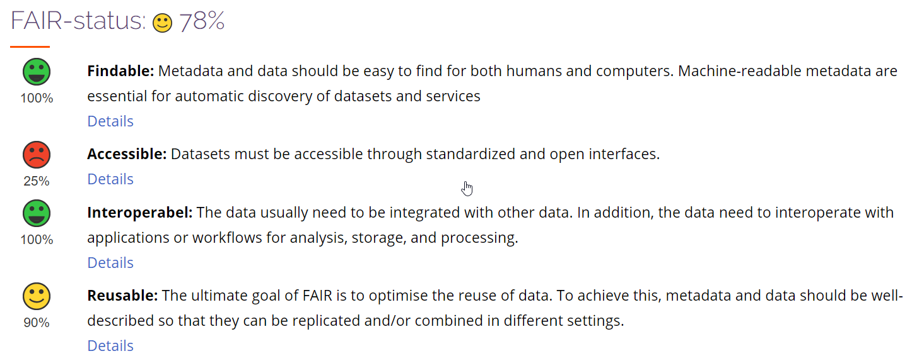
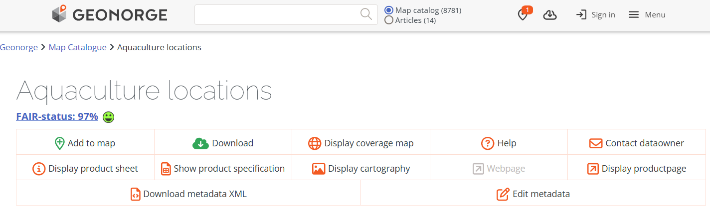

# _NO_ - _2026_: Country Fiche

## Table of Contents
1. [Introduction](#introduction)
1. [State of Play](#state_of_play)
   1. [Coordination](#coordination)
   2. [Functioning and coordination of the infrastructure](#functioning)
   3. [Usage of the infrastructure for spatial information](#usage)
   4. [Data Sharing Arrangements](#data)
   5. [Costs and Benefits](#costs)

## Introduction

The Norwegian Mapping Authority is responsible for the coordination of the Spatial Data Infrastructure (NSDI) in Norway. The authority has the responsibility for the monitoring and reporting of the INSPIRE directive and holds the role as the Norwegian National Contact Point. 

## State of Play 

In 2025, the Ministry of Finance signalled funding for a five-year modernisation programme for
the "NSDI" (Norway Digital), with the first year commencing in 2026.
This funding is contingent on the continued use of the governance model for the Norway Digital (ND) shared solutions.
The development of these solutions is to be user-driven, requiring genuine stakeholder participation and joint responsibility among the partners for
setting directions and priorities.

The governance model, established in 2024, is designed to ensure such involvement by providing structures through which partners contribute across all phases of development.
The partners in the Norway Digital cooperation represent the user side and play a central role in defining needs, prioritising development initiatives, and setting the direction for architecture and standardisation. Through bodies such as the Board, the Technical Advisory Committee, and the Product Councils, the model facilitates coordinated decision-making, transparent prioritisation processes, and alignment with agreed strategic objectives.

The modernisation programme includes further development of core components such as Geonorge, with the aim of ensuring that the infrastructure can handle increased usage and data volumes, while supporting modern standards and interfaces. A key priority is to establish robust mechanisms for authentication and authorisation, enabling secure and efficient access to geospatial data for different user groups.

### Coordination

#### National Contact Point

- Name of Public Authority: Kartverket
- Postal Address: Postboks 600 Sentrum, 3507 Hønefoss
- Contact Email: post@kartverket.no
- Telephone Number: +47 32 11 80 00
- National INSPIRE Website: [http://www.kartverket.no](http://www.kartverket.no)
- MIG Contacts: 
  - Contact Person: Dag Høgvard
  - Email:dag.hogvard@kmd.dep.no
  - Contact Person: Lars-Inge Arnevik
  - Email: lars-inge.arnevik@kartverket.no
- MIG T Contacts: 
  - Contact Person: Henrik Gulliksen Schuller 
  - Email: henrik.gulliksen.schuller@kartverket.no
  - Contact Person: Lars-Inge Arnevik
  - Email: lars-inge.arnevik@kartverket.no
 
#### Coordination Structure & Progress: 

##### Coordination structure

The Norwegian Mapping Authority is responsible for the coordination of the Spatial Data Infrastructure (NSDI) in Norway. The authority has the responsibility for the monitoring and reporting of the INSPIRE directive, and holds the role as the Norwegian National Contact Point. Responsible ministry is Ministry of Local Government and Regional Development.

The Ministry of Local Government and Regional Development has set a National geodata advisory board, giving high level advice to the ministry. 

Both public and private organisations are represented. There is an operative National geodata coordinating committee, as defined in regulation under the geodata act. The latter works on strategic directions, coordinates action and gives advice to the Norwegian Mapping Authority as national coordinator of the spatial data infrastructure. Representatives cover national agencies under each ministry, together with municipality and county representatives. There are underlying technical and thematic working groups.

The Norwegian NSDI cooperation "Norway Digital" now comprises more than 500 parties, including about 50 governmental authorities and ministries with interest in spatial data management, all municipalities (more than 350), all county administrations and 130 electricity and other utility companies. The participation of each party is formalised by means of an agreement. The Norwegian NSDI has a broad representation from different sector organisations.

The Ministry of Local Government and Regional Development recommends and mandates Norway Digital to coordinate actions by the parties to fulfil requirements defined in the Norwegian Geodata act (2010). The Geodata act and bylaws implements the INSPIRE directive in Norwegian law in accordance with the EEA Agreement, cf. point 1j in Chapter I of Annex XX of the Agreement. 

“Norway Digital” is the focal point for the INSPIRE implementation. The INSPIRE implementation efforts have in the recent years mainly focused on the identification, description and tagging of as-is INSPIRE datasets. These data are of high-quality and are being used in everyday digital workflows in municipalities, county administrations, national authorities and the private sector. Most of the data are harmonized according to national data specifications, adapted to the national legislation and everyday work in most sector activities. The Norwegian as-is data aims to follow major INSPIRE regulations, such as data sharing principles and accessibility of network services etc. Data and services are well documented with metadata following the INSPIRE principles. 

##### Progress

**Metadata: and data sharing** 
The INSPIRE directive and underlying regulations define a series of requirements. Some of the requirements are quite ambitious and even if the NSDI provides good metadata, downloadable and viewable datasets, they do not totally comply with the requirements. Because of this, the indicators shows low goal achivement. There is a good overall response on data sharing. The number of services and datasets are about the same as previous years.  However, in many cases the linkage from the dataset's associated services, does not appear in the INSPIRE Geoportal, as it is not according to the guidelines for service linkage. There were plans to improve the linkage in 2024 and 2025, but this were not fullfilled due to lack of available resources and focus on modernisation of the NSDI. The services metadata are however linked to the dataset metadata (by the "operatesOn" element) and this works well in the national geoportal.

The amount of harmonized metadata has fluctuated in recent years but has remained around 80%. Also this year we had some temporary problems with metadata, this time for the service metadata, which made metadata fail the validation. All metadata are however following the the technical guidelines from INSPIRE and are good for use, but some minor "errors" prevents the metadata to fullfill the INSPIRE validation services. Metadata harvested from the national Geoportal (Geonorge) to the European Data Portal as DCAT-metadata gets the highest score (Excellent) in the EDP metadata rating.  

**Services:** 
Besides this, the development towards all technical requirements is still relatively low - particularly when it comes to conformity of services. This may be seen in the validation services offered by the European Commission. Some of the validation errors are also caused by stakeholder's open-source software and hard to get rid of. We are also questioning the need of tests that goes beyond interoperability and reports errors related to issues that will not affect the use of the services. Such errors could give a warning, and the validation could pass. Services are, despite of validation problems, well used in the national infrastructure.

**Datasets:** 
Concerning INSPIRE harmonization requirement for datasets, INSPIRE progress is lower. Norway has pr. 1.1.2026 eleven harmonized datasets available in the INSPIRE geoportal, mostly covering Annex I data themes. These datasets are availble as view (WMS) and download (WFS) services. Concerning Annex II and III themes, the formal requirement for Norway was to deliver these by end 2023. A number of organisations have still not given priority to develop harmonised data for data sets falling under Annex II and III. 

Many organisations offer as-is sector specific data. 19 organisations offer data that falls under the INSPIRE directive thematic focus. The data content that is delivered generally holds a very high quality, with a high level of detail and accuracy. Many of the Norwegian INSPIRE data services are incorporating or based on detailed data from locally organised data capture. Many of the themes also have a reasonable to high updating frequency.

**Delivery of priority environmental reporting data:** 
EU Commission has defined certain Inspire data sets to be of high priority. A sub-group under the Maintenance and Implementation Work Programme 2017-2020 has developed a list of datasets related to environmental reporting (PDS). 
The list defines approximately 90 dataset. Approximately 45-55 of these are relevant for Norway. So far, Norway has established 15 dataset with metadata and as-is view-services. This number corresponds to 28 datasets in the list. 
Download services according to Inspire-standards (WFS and Atom) are not established, and there are technical issues regarding linking between metadata and services that needs to be sorted out. 

**Inspire and HVD:** 
There are ongoing processes concerning the implementation of the Open data directive (ODD) and high-value datasets (HVD) in Norway. The implementation into national law is planned to be carried out in the coming years as part of the EEA (European Economic Area agreement) agreements. The national INSPIRE community has started to see how implementation of the two legal acts can get a coordinated implementation at technical level. There are also discussions on how to implement the “free of charge”- requirement in HVD which is not a requirement in INSPIRE, as less income may affect data quality negatively. There is also ongoing work evaluating the vulnerability by exposing open datasets that might affect international relations, public security or national defence.  The National Geoportal supports the HVD-tagging for both ISO-metadata and DCAT, but the process of defining HVD-datasets has not yet started in Norway. 

**National geospatial strategy and action plan:** 
A National Geodata Strategy was launched in late 2018 and lasts to 2025. In this strategy the government sets an aim to boost the use of spatial data in the Norwegian society, in order fulfil the UN sustainability goals, boost economy and develop an effective and wellfunctioning public sector. A new "strategy" are under consideration and will be aligned with and to a greater extent be based on horizontal national regulations.

### Functioning and coordination of the infrastructure 

The INSPIRE infrastructure is not seen as an independent infrastructure but as a part of the national spatial data infrastructure. The new governance model for the Norway Digital (ND) shared solutions revitalizes the cooperation and gives utterly strength to the modernisation of the NSDI. 

The implementation is also linked to elements of the national general digitization policy and infrastructure – constituting the Digital-agenda-implementation. 

At national level there is a close follow up of the different stakeholders. Stakeholders are active, delivering according to the INSPIRE technical requirements where these corresponds the national needs, e.g. sharing data openly and establishing metadata, view services and download services. There is relatively low interest in implementing INSPIRE harmonized data. 

### Usage of the infrastructure for spatial information 
The Norwegian geoportal holds a central place in the Norwegian infrastructure. It contains metadata for all datasets and services falling under the INSPIRE directive, as well as other geodata. The portal is free for all to use as a metadata management system and as a discovery service. The portal is developed and maintained by the Norwegian Mapping Authority. 

The geoportal [https://www.geonorge.no](https://www.geonorge.no) is a web site with catalogue, but in addition it contains a series of tools and api’s- central processing functionalities for data file production, web service production, register management etc. It is becoming an increasingly important element in the general public sector digitalization infrastructure. 

Data are available as downloadable files in different formats, e.g. GML, FGDB and postgis, together with the national format SOSI. Most of them validates towards the structure described in national Data Product Specifications.Usually the datasets have corresponding view and download services. The last years there has been a rapid increase in the development of download services being offered through the national geoportal (WFS, Atom Feed, Geonorge download API). Several stakeholders have implemented latest generation of OGC-API’s as OGC feature API and OGC Processes API. The maturety of these services are a lower what comes to data structure and corresponding Data Product Specification, but the threshold for use is noticeably lower. We expect  rapid growt in implementations of new OGC API's and Cloud Technolgy the next years. This will benefit both the data providers as well the data users and will also affect the architecture of data sharing.      

A client for reading Atom feeds has for many years made it much easier for many users to subscribe to and download updated datasets.
There is a rapid growth in the use of the subscription tool, by both public sector and private companies. This shows that many users still choose to store data locally, and that on the fly data access is mostly limited to view services. A standardized way of updating single features in datasets wil be welcomed. 

The use of the data and services in growing. Through regulations in the Planning and Building Act there are expectations in active use of reference data and thematic data in the different phases of land use planning, building permit applications, construction work, environmental impact assessments etc. Advanced checking tools have been introduced the last 5 years, based on spatial overlay analyses in the land use planning tools. This development is depending on the good and growing availability of data and spatial data services. Municipalities use data and services from the geoportal and spatial data infrastructure, either directly or through systems and cloud services being offered by private companies. The private companies are major users of the infrastructure. Use is also increasing in crisis management, agriculture and forestry, fisheries, transport sector and others. 

### Data Sharing Arrangements 

Norway has an open data policy. Most spatial data sets (more than 90%) are classified as open. There are good overviews of open data in the Norwegian geoportal and open data licenses have been attached or linked up to the metadata. In Norway mostly two open data licenses are being used, [the National Open Data License (NLOD)](http://data.norge.no/nlod/no/2.0) and the international license Creative Commons (CCBY). Metadata contains information if data sets are open or not. This information is harvested by the Inspire geoportal, The European open data portal and [the Norwegian open data portal](https://www.data.norge.no).

**Fair implementation in Norway** 

The Norwegian geospatial infrastructure has coupled the FAIR principles and the OGC and ISO-based requirements defined in INSPIRE and the national geodata act. The system evaluates the different dataset resources according to the FAIR principles. Mainly is it focused on good metadata with a search API, the use of international standards regarding API's and formats as well as interoperability and standardized documentation. The system is implemented as a FAIR-registry which includes the most important dataset in our SDI, and it is updated each night by automatical tests. The results are also visualised in the metadata catalogue and gives valuable feedback to both delivery organisations and end users. Examples are found in 
* [FAIR Register](https://register.geonorge.no/fair-register?lang=en)
* [FAIR evaluation on dataset: Aquaculture - locations](https://register.geonorge.no/fair-register/akvakultur-lokaliteter/bc6bde11-5c54-4059-a942-e90c0a050afa)
* [Metadata for FAIR evaluated dataset](https://kartkatalog.geonorge.no/metadata/aquaculture-locations/4ca8af5e-ffc7-4636-847d-4eca92c4a3b0)

*Fig 1: Example of FAIR evaluation of dataset in the national geoportal register*  
  
    

*Fig 2: Example of FAIR rating of dataset in the national geoportal*

### Costs and Benefits 

Norwegian Mapping Authority has a small and effective secretariat coordinating NSDI development in general, and for INSPIRE in particular. Implementation is done by the principle of distributed responsibilities, where each stakeholder/organisation holding data is to implement according to documentation and data flow requirements. Most organisations are active in sharing as-is data according to Norwegian data models and with satisfactory resource use. 

Benefits have been increasing rapidly the last years, particularly on the as-is-data, as mentioned above, while the utilization of the Norwegian harmonized INSPIRE data sets is low. A broad set of public bodies in many sectors, nearly all 357 municipalities, consulting firms and value-adders are setting up advanced systems for consuming data from the infrastructure, including automated overlay analysis of a series of spatial data sets. They are now showing an increasing trust in and use of the access services, probably because the services are open and freely available, they are stable and they receive data of importance to their work. 
