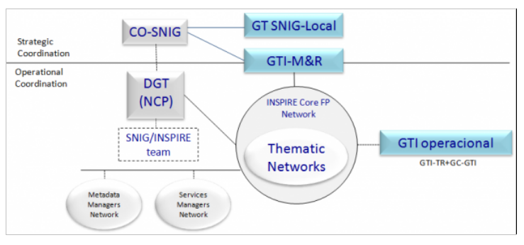

# _PT_ - _2024_: Country Fiche

## Table of Contents
1. [Introduction](#introduction)
1. [State of Play](#state_of_play)
   1. [Coordination](#Coordination)
   2. [Functioning and coordination of the infrastructure](#functioning)
   3. [Usage of the infrastructure for spatial information](#usage)
   4. [Data Sharing Arrangements](#data)
   5. [Costs and Benefits](#costs)

## Introduction

The INSPIRE Directive sets the minimum conditions for interoperable sharing and exchange of spatial data across Europe as part of a larger European Interoperability Framework and the e-Government Action Plan that contributes to the Digital Single Market Agenda. Article 21 of [INSPIRE Directive](https://eur-lex.europa.eu/eli/dir/2007/2/oj) defines the basic principles for monitoring and reporting. More detailed implementing rules regarding INSPIRE monitoring and reporting have been adopted as [Commission Implementing Decision (EU) 2019/1372](https://eur-lex.europa.eu/eli/dec_impl/2019/1372/oj) on the 19th August 2019.
This country fiche highlights the progress in the various areas of INSPIRE implementation. It includes information on monitoring 2023 acquired in December 2023 and Member States update.

## State of Play

A high-level view on the governance, use and impact of the INSPIRE Directive in Portugal. More detailed information is available on the [INSPIRE knowledge base](https://knowledge-base.inspire.ec.europa.eu/index_en).

### Coordination

#### National Contact Point

- Name of Public Authority: Direção-Geral do Território (DGT) | Directorate-General for the Territory
- Postal Address: Rua da Artilharia Um, 107
  1099-052 Lisboa PORTUGAL
- Contact Email: ppatricio@dgterritorio.pt
- Telephone Number: (+351) 21 381 96 00
- Telefax Number: (+351) 21 381 96 93
- National INSPIRE Website: [https://snig.dgterritorio.gov.pt/](https://snig.dgterritorio.gov.pt/)
- MIG Contacts: 
  - Contact Person: Alexandra Fonseca
  - Email: afonseca@dgterritorio.pt
  - Contact Person: Paulo Patrício
  - Email: ppatricio@dgterritorio.pt
  - Contact Person: Mário Caetano
  - Email: mario.caetano@dgterritorio.pt
  - Contact Person: Joaquim Pinto da Costa
  - Email: joaquim.costa@apambiente.pt
- MIG T Contacts: 
  - Contact Person: Danilo Furtado
  - Email: dfurtado@dgterritorio.pt
  - Contact Person: Henrique Silva
  - Email: hsilva@dgterritorio.pt
  - Contact Person: Paulo Patrício
  - Email: ppatricio@dgterritorio.pt
  - Contact Person: Marta Medeiros
  - Email: marta.ip.medeiros@azores.gov.pt
  - Contact Person: Francisco Caldeira
  - Email: francisco.caldeira@ine.pt
 
    

#### Coordination Structure & Progress: 

##### Coordination structure

- DGT represents Portugal at IC, MIG and MIG-T since the beginning but since 2018 these representations were enlarged to some other public authorities, namely Portuguese Environmental Agency (APA), in MIG, National Statistics Institute (INE) and Azores Autonomous Region (RAA), in MIG-T.
- CO-SNIG (Conselho de Orientação do SNIG) is responsible for the strategic coordination of the National Spatial Data Infrastructure (NSDI), i.e. Sistema Nacional de Informação Geográfica (SNIG). This committee is chaired by DGT and co-chaired by APA and includes all the entities identified as responsible for the datasets embraced by INSPIRE Directive. 
- Networks: SNIG Network (the SNIG Network covers all public and private entities that produce and provide geographic data sets and services); INSPIRE Focal Points Network (public authorities producing national data sets and services); INSPIRE Core Focal Points Network (a sub-set of the previous one with the public authorities formally responsible for producing national datasets and services regarding the themes of the three INSPIRE Annexes); Network of Metadata Managers and Network of Spatial Data Services Managers.
- Working Groups (WG): M&R WG, a CO-SNIG sub-group dedicated to support INSPIRE monitoring and reporting, since 2010; GTI-Op, operational group that includes technicians from various entities with extensive experience in technical and thematic matters related to GI and the INSPIRE directive, as well as the coordinator of the M&R WG; 9 Thematic Networks associated with the INSPIRE Themes clusters (the previous 9 GTI-TE).
- GT SNIG-Local, created more recently, involving the inter-municipality’s communities (CIM), aiming to better integrate the local level within the national SDI.
- Hydrographic Institute (IH) is actively involved in the International Hydrographic Organization Marine Spatial Data Infrastructures Working Group (MSDIWG)  more information: https://iho.int/en/msdiwg. The 2025 meeting will take place in Portugal, at the Hydrographic Institute. It is also chairing the International Hydrographic Organization Eastern Atlantic Hydrographic Commission (EAtHC) Marine Spatial Data Infrastructures (MSDI) Working Group  More information on: https://iho.int/en/eathc-msdiwg. Moreover is actively involved in the UN-GGIM Working Group on Marine Geospatial Information   more information: https://ggim.un.org/UNGGIM-wg8.

##### Progress

- Annual Action Plans for implementing SNIG 2020 vision – during this year, entities continued to be dedicated to the creation and improvement of their metadata and creation/validation of spatial data services.
- European events and meetings on SDI and INSPIRE (e.g. MIG and MIG-T meetings as well as in some of the sub-groups) continued to be followed.
- Some surveys were answered, during 2023:	
  - 5th edition of the GeoBuiz - Survey- National Geospatial Agencies Trends and Directions 2023
  - DIS4SME - Survey on location data interoperability skills for SMEs
  - EuroSDT - Academia-Business cooperation requirements towards establishment of efficient SDI
- In terms of High Value Datasets, DGT promoted the discussion of the EC High value datasets Implementing Act (Regulation 2023/138 (UE)) at CO-SNIG involving also AMA (Agência para a Modernização Administrativa). CO-SNIG approved an Excel template to allow the identification of the HVD by each SNIG entity, according to the thematic categories established by the Open Data Directive. The preliminary results were presented at CO-SNIG and in different events namely JIIDE and ENiiG 2023.
- DGT continued to held throughout 2023, several technical meetings (mostly bilateral) with the various entities that report Metadata and Spatial Data Services (SDS) to INSPIRE.
- Organization of ENiiG, 2023 - Encontro Nacional de Infraestruturas de Informação Geográfica (http://eniig.dgterritorio.pt/), the annual national event on SDI, which took place on December 13, 2023. This edition was dedicated exclusively to the availability of geographical open data through the national Open Data Portal, dados.gov, and was organized with the collaboration of Agência para a Modernização Administrativa (AMA).  
- The 8th edition of ENiiG focused on the articulation of SNIG with dados.gov portal, the platform for Portuguese open public data, under the responsibility of AMA. This portal's function is to aggregate, reference and host open data from different bodies and sectors of Public Administration, being the central catalogue of open data in Portugal.
ENiiG 2023 intended to address the topic of open data, considering the aspects related to its availability and reuse, namely through API, as well as the licenses associated with its use. This event also addressed the current and future role of SNIG in the provision of geographic open data and its articulation with the dados.gov portal, in particular with regard to High Value Data Sets. 
Xout 150l.  the model CartTop. was organized with the collaboration of theAbout 300 people attended the event.
 SNIG with the data.gov portal,es during 2023, namelly 
- Besides HVD issues other guidelines for SNIG future development established in the previous year were addressed during 2023, namely: the efforts towards the renewal of the National Geographic Data Registry (RNDG)  concerning existing metadata systematization and updating and aiming to ensure metadata quality (e.g. correction of inconsistencies and errors, detection of gaps and harmonization of criteria for filling in the descriptive fields); the increase of the number of geographic datasets available through open data policies; progress in the articulation of SNIG with the data.gov portal; the performance of courses on SNIG for the central, regional and local public administration, which involved almost 500 users, contributing to the dissemination of the SDI and its geoportal. Moreover, the approach to promote the involvement of SNIG users through the application of co-creation processes has been redefined. 
- Some capacity-building activities, provided at the European level, were internally followed by the members of PT INPIRE structures.
- Cooperation with Spain: the collaboration around the organization of the Iberian SDI event, JIIDE, continued; bi-lateral meetings on cartography production (e.g. land cover/land use cartography, LiDAR data) occurred in the context of the Action 2019-2-31: Fostering cooperation between Spain and Portugal in the Copernicus land domain.
- JIIDE 2023 (https://www.jiide.org/pt/inicio), the XIV edition of this event, took place from 6 to 8 November 2023, in Évora, organized by DGT from Portugal with the collaboration of the CNIG from Spain and was focused on the topic "Contributions of Spatial Data Infrastructures to High-Value Datasets”. The event included 13 Sessions, with around 60 presentations, with Portuguese and Spanish speakers, 1 invited keynote speaker, 1 round table and 7 workshops. 300 participants have attended this Conference. 
- Guarantying the articulation of SNIG with thematic and regional SDIs (e.g. SNIAMB, IDEIA RAA, IRIG RAM, SNIT, ICNF, IH and LNEG metadata catalogues harvesting process) proceeded during 2023, being a routine task for SNIG.
- Efforts for the articulation of SNIG with the open data portal, https://dados.gov.pt/pt/ continued.
  - SNIG and the open data portal (https://dados.gov.pt) are articulated. Open data registered on SNIG is now also registered on dados.gov by harvesting.
- The collaboration of DGT staff in activities developed with universities continued, e.g. teaching SDI issues in Master degrees (e.g. Masters on Geospatial Information from University of Lisbon). An effort is being made to sign collaboration protocols with different academic organizations on SNIG and other issues. 
- The new technical specifications for the Portuguese reference cartography, published in 2019, now used in a regular basis, continued to be updated and improved in 2023.
- The two projects approved in 2020 by the SAMA 2020 programme, proceeded in 2023:
  - SMOS – Sistema de Monitorização de Ocupação do Solo, a Land Use Land Cover Monitoring System based on new digital Space Technologies and Artificial Intelligence aiming to support the integrated management of rural fires. SMOS was conceived and developed by DGT with the aim of continuously producing basic and thematic cartographic information on land use and land cover (Despacho n. 291 /2023, Diário da República of January 6). It is a collaborative and multifunctional system that involves the Public Administration, the national scientific and technological system, the private sector and the citizen, guided by user needs and with an open data policy. SMOS is already operational and produces reliable, updated and open information on the dynamics of land cover/land use, which can be translated into strategic knowledge with application in the areas of land use planning, agriculture, forestry, water resources, civil protection, education, scientific research and all public and private activities that need access to up-to-date data on land use and land cover information.
  - Território Digital – Modernização, Cocriação e Partilha de Informação Geográfica, Cadastral e Territorial a system focused on the modernization, co-creation and sharing of Geographic, Cadastral and Territorial Information. The requirements for the implementation of 3 infrastructures were concluded. : BDNCP – Cadastre National Database, BDNC – Cartography National  Database and PCAT - Territory Agenda Collaborative Platform
  - The results of these two projects continue to have a positive impact on the INSPIRE and SNIG implementation as they promote the use of more spatial data by all users, and the involvement of more and new users.
- In 2023, the activities defined in the Portuguese Recovery and Resilience Plan (PRR) continued. This investment programme will continue financing more activities relevant for SDI development, focused on application development, spatial data acquisition and spatial data access and dissemination. 

### Functioning and coordination of the infrastructure 

- The Plano de Ação INSPIRE.PT 2023 (action plan for INSPIRE in Portugal), maintained the same priority areas: (1) Make available, through visualization and download services, all reported SDS (starting by the PDS); (2) Ensure interoperability of the viewing and the download services; (3) Harmonize SDS (according to the capacity of each entity).
- During 2023 the INSPIRE Core Focal Points Network (INSPIRE CFPN) entities have been working on the same activities, namely: 
  - Proceeding with metadata revision to improve search and access to the GI through the geoportal and to complete metadata with missing information (e.g. data policy).  
  - Increasing the spatial data services for the reported metadata.
  - Validating the spatial datasets and services using the INSPIRE Reference Validator.
- Some evolution occurred at the regional SDI level, namely:
  - IRIG RAM - ROTe continued to enhance the regional geographical data registry established by Regional Decree No. 8/2023/M. These enhancements include both increased availability of datasets and improvements in their quality. Under the scope of SNIG, DROTe has identified high-value datasets previously classified as ‘regional interest themes.’ The aim is to integrate this geospatial data from the Madeira autonomous region into the national open data portal.
  - RAA - Autonomous Region of the Azores (RAA) launched a new Spatial Data Infrastructure and a new online portal (available at https://idea.ambiente.azores.gov.pt/), through which entities can:
    1. access to the Azorean Metadata Catalogue (available at https://sma.idea.azores.gov.pt/geonetwork/) which is called “Sistema de Metadados dos Açores (SMA)”;
    2. download the Azorean Metadata Manager (available at https://idea.ambiente.azores.gov.pt/metadados/) which is called “Gestor de Metadados dos Açores (GeMA)”. This application allows entities to create, edit and submit automatically to “Sistema de Metadados dos Açores (SMA)” their metadata in accordance with INSPIRE Directive specifications;
    3. share their geographic information through online viewers (available at https://visualizador-idea.ambiente.azores.gov.pt/). At his moment, the creation of online viewers is restricted to the entities of the Regional Government of the Azores.
 
- Hydrographic Institute (IH) has implemented the OGC API Features (https://api-features.hidrografico.pt).
- IH and the Portuguese Sea and Atmosphere Institute (IPMA) are working together to develop the Portuguese National Oceanographic Data Center (NODC-PT) for the program “International Oceanographic Data and Information Exchange" (IODE) of the "Intergovernmental Oceanographic Commission" (IOC) of UNESCO. NODC-PT catalog will be hosted at https://data.nodc-portugal.pt.
- SNIG entities, through CO-SNIG, were involved in selecting their HVD from SNIG data and beyond, contributing to the process each Member State has to perform in order to comply with the Open Data Directive and its implementing act on HVD. 
- DGT and some other SNIG entities collaborated with AMA in a study focused on the open data and HVD impact evaluation.
- INSPIRE monitoring process in 2023 – The process automatically based on the information obtained from the SNIG INSPIRECORE metadata, occurred in December 21, 2023. The INSPIRE monitoring results are available at the INSPIRE Geoportal here: https://inspire-geoportal.ec.europa.eu/catalog/views/inspireportal/monitoringreporting/site/mr2023.html  
- The previously defined implementation of a collaborative activity for the involvement of the different users on the definition of SNIG evolution strategy/needs using co-creation processes was postponed to 2024. 
- The organization of JIIDE 2023 (https://www.jiide.org/pt/inicio), the XIV edition of this event, was performed and occurred from 6 to 8 November 2023 in Évora. Promoted by DGT from Portugal with the collaboration of CNIG from Spain, the event was focused on the topic "Contributions of Spatial Data Infrastructures to High-Value Datasets”. This topic was chosen, aiming to contribute to support the implementation of the Open Data Directive and its implementing act on High-Value Datasets. Around 20 presentations from Portugal were performed.
Considering SNIG entities participation in JIIDE 2023: 
  - DGT presented 6 communications: 
    - “Conjuntos de dados de elevado valor no domínio da IG em Portugal: O papel do SNIG” A. Fonseca, DGT; 
    - “A articulação entre o SNIG e o dados.gov para os dados abertos”, D. Furtado (DGT), A. Soares (AMA);
    - “Informação LiDAR para Portugal Continental”, P. Patrício, DGT; Especificações e normas técnicas para cartografia topográfica / 
    - Evolução do modelo CartTop, A. Seara (DGT); 
    - “Visualização da cartografia baseada no modelo CartTop. Ferramentas de visualização e conversão dos dados.”, A. Serronha (DGT); 
    - “Validação da cartografia baseada no modelo CartTop. Ferramentas de controlo de qualidade”, H. Silva (DGT); 
    - “Evolução do Sistema de Monitorização da Ocupação do Solo (SMOS) da Direção-Geral do Território: Um sistema em constante evolução”, Pedro Benevides (DGT)).
  - Other Portuguese entities presented their work: 
    - Agência Portuguesa do Ambiente (APA) presented a communication on remote sensing and machine learning techniques for water bodies delimitation “Deteção e Delimitação de Corpos de Água em Imagens de Satélite de Alta Resolução com Aprendizagem Profunda: Um Estudo Preliminar com o Detectron2: Identificação e Delimitação Corpos de Água por Técnicas de Visão Computacional e de Machine Learning”, S. Fernandes; I. Patriarca; A. Fialho (APA)). 
    - Instituto Hidrográfico (IH) participated with a communication on marine data and the blue economy “Infraestruturas de dados marinhos como catalisadores da economia azul”, P. Nunes (IH)) and another on the ocean data “Um oceano aberto e transparente”, Telmo Dias (IH)); 
    - Comissão de Coordenação e Desenvolvimento Regional do Norte (CCDR-NORTE) communication was focused on participatory planning “Um PROT-NORTE participado e Aberto. Registo de Dados Geográficos de suporte ao PROT-NORTE”, R. Pinho, CCDR-NORTE); 
    - Laboratório Nacional de Energia e Geologia (LNEG) presented a communication on LNEG Geoportal and open Data “Dados abertos no GeoPortal da Energia e Geologia / Enquadramento, tipologia e gestão”, A. Pereira (LNEG));
    - Instituto do Financiamento da Agricultura e Pescas (IFAP) presented a communication on IFAP data from diferent perspectives “A informação geográfica do IFAP. As diversas abordagens. Directiva INSPIRE, Partilha de dados, dados de elevado valor, regulamentos do PEPAC: a perspectiva conciliadora”, J. Falcão (IFAP)).

- The organization of courses on SNIG started during 2023 and will proceed in 2024 (https://www.dgterritorio.gov.pt/Curso-pratico-line-sobre-o-SNIG), a capacity building initiative that aims to increase the use of SNIG capabilities.
- The organization of courses on SMOS - Sistema de Monitorização da Ocupação do Solo occurred during 2023 (https://smos.dgterritorio.gov.pt/index.php/cursos-e-seminarios) and involved several users of the Portuguese SDI, more interested on the data related to Land use/Land cover.   

### Usage of the infrastructure for spatial information 

< insert text >

### Data Sharing Arrangements 

< insert text >

### Costs and Benefits 

< insert text >
