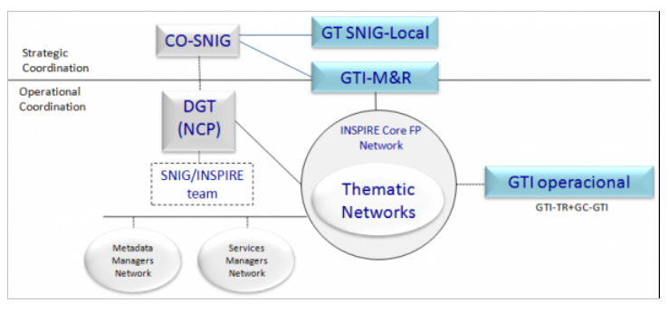

# _PT_ - _2025_: Country Fiche

## Table of Contents
1. [Introduction](#introduction)
1. [State of Play](#state_of_play)
   1. [Coordination](#Coordination)
   2. [Functioning and coordination of the infrastructure](#functioning)
   3. [Usage of the infrastructure for spatial information](#usage)
   4. [Data Sharing Arrangements](#data)
   5. [Costs and Benefits](#costs)

## Introduction

The INSPIRE Directive sets the minimum conditions for interoperable sharing and exchange of spatial data across Europe as part of a larger European Interoperability Framework and the e-Government Action Plan that contributes to the Digital Single Market Agenda. Article 21 of [INSPIRE Directive](https://eur-lex.europa.eu/eli/dir/2007/2/oj) defines the basic principles for monitoring and reporting. More detailed implementing rules regarding INSPIRE monitoring and reporting have been adopted as [Commission Implementing Decision (EU) 2019/1372](https://eur-lex.europa.eu/eli/dec_impl/2019/1372/oj) on the 19th August 2019.
This country fiche highlights the progress in the various areas of INSPIRE implementation. It includes information on monitoring 2024 acquired in December 2024 and Member States update.

## State of Play

A high-level view on the governance, use and impact of the INSPIRE Directive in Portugal. More detailed information is available on the [INSPIRE knowledge base](https://knowledge-base.inspire.ec.europa.eu/index_en).

### Coordination

#### National Contact Point

- Name of Public Authority: Direção-Geral do Território (DGT) | Directorate-General for the Territory
- Postal Address: Rua da Artilharia Um, 107
  1099-052 Lisboa PORTUGAL
- Contact Email: ppatricio@dgterritorio.pt
- Telephone Number: (+351) 21 381 96 00
- Telefax Number: (+351) 21 381 96 93
- National INSPIRE Website: [https://snig.dgterritorio.gov.pt/](https://snig.dgterritorio.gov.pt/)
- MIG Contacts: 
  - Contact Person: Alexandra Fonseca
  - Email: afonseca@dgterritorio.pt
  - Contact Person: Paulo Patrício
  - Email: ppatricio@dgterritorio.pt
  - Contact Person: Joaquim Pinto da Costa
  - Email: joaquim.costa@apambiente.pt
- MIG T Contacts: 
  - Contact Person: Danilo Furtado
  - Email: dfurtado@dgterritorio.pt
  - Contact Person: Paulo Patrício
  - Email: ppatricio@dgterritorio.pt
  - Contact Person: Marta Medeiros
  - Email: marta.ip.medeiros@azores.gov.pt
  - Contact Person: Francisco Caldeira
  - Email: francisco.caldeira@ine.pt
 
    

#### Coordination Structure & Progress: 

##### Coordination structure

- DGT represents Portugal at IC, MIG and MIG-T since the beginning butever since 2018 these representations were enlarged to some other public authorities, namely Portuguese Environmental Agency (APA), in MIG, National Statistics Institute (INE) and Azores Autonomous Region (RAA), in MIG-T.
- CO-SNIG (Conselho de Orientação do SNIG) is responsible for the strategic coordination of the National Spatial Data Infrastructure (NSDI), i.e. Sistema Nacional de Informação Geográfica (SNIG). This committee is chaired by DGT and co-chaired by APA and includes all the entities identified as responsible for the datasets embraced by INSPIRE Directive. 
- Networks: SNIG Network (the SNIG Network covers all public and private entities that produce and provide geographic data sets and services); INSPIRE Focal Points Network (public authorities producing national data sets and services); INSPIRE Core Focal Points Network (a sub-set of the previous one with the public authorities formally responsible for producing national datasets and services regarding the themes of the three INSPIRE Annexes); Network of Metadata Managers and Network of Spatial Data Services Managers.
- Working Groups (WG): M&R WG, a CO-SNIG sub-group dedicated to support INSPIRE monitoring and reporting, since 2010; GTI-Op, operational group that includes technicians from various entities with extensive experience in technical and thematic matters related to GI and the INSPIRE directive, as well as the coordinator of the M&R WG; 9 Thematic Networks associated with the INSPIRE Themes clusters (the previous 9 GTI-TE).  Some of these groups have now a reduced activity and Thematic Networks are no longer operational.
- GT SNIG-Local, created more recently, involving the inter-municipality’s communities (CIM), aiming to better integrate the local level within the national SDI.
- Hydrographic Institute (IH) is actively involved in the International Hydrographic Organization Marine Spatial Data Infrastructures Working Group (MSDIWG)  more information: https://iho.int/en/msdiwg. The 2025 meeting took place in Portugal, at the Hydrographic Institute, from 18th to 21st March 2025. It is also chairing the International Hydrographic Organization Eastern Atlantic Hydrographic Commission (EAtHC) Marine Spatial Data Infrastructures (MSDI) Working Group  More information on: https://iho.int/en/eathc-msdiwg. Moreover IH is actively involved in the UN-GGIM Working Group on Marine Geospatial Information   more information: https://ggim.un.org/UNGGIM-wg8.

##### Progress

- Annual Action Plans for implementing SNIG – during the year, entities continued to be dedicated to the creation and improvement of their metadata and creation/validation of spatial data services.
- European events and meetings on SDI and INSPIRE (e.g. MIG and MIG-T meetings as well as in some of the sub-groups) continued to be followed.
- Some surveys were answered, during 2024:	
  - OURdata, OCDE, February 21, 2025. 
  - EuroSDR - Specification of Point Cloud Datasets in Europe – August 2024
  - Open data maturity Landscaping Questionnaire, Data.europa.eu, June 3, 2024.
  - Survey “Preferred approaches for a good practice that maximizes the reuse of INSPIRE for HVD”, MIG, May 27, 2024
  - Open Maps for Europe, Eurogeographics, March 6, 2024.
  - EuroSDR - Advancing FELA – The Framework for Effective Land Administration II, Março 2024
- In terms of High Value datasets, one of the issues included in SNIG Future development guidelines, DGT participated as invited speaker in a Workshop organized by AMA (Agência para a Modernização Administrativa) and CETIC (Conselho Estratégico das Tecnologias de Informação e Comunicação) on HVD within Public administration (https://dados.gov.pt/pt/posts/a-ama-e-o-ctic-promoveram-o-workshop-conjuntos-de-dados-de-elevado-valor-dados-abertos-na-administracao-publica-1/). The event aimed to raise awareness on the need to comply with Regulation (EU) 2023/138, which establishes the list of public data sets with special potential to generate socioeconomic benefits – High-Value Data Sets – and the requirements for their provision. Moreover, SNIG entities continued their efforts to tag and publish the identified HVDs according to the requirements (metadata keyword; data formats; Licensing; development of OGC APIs).
- DGT continued to held throughout 2024, technical meetings (mostly bilateral) with the various entities that report Metadata and Spatial Data Services (SDS) to INSPIRE. 
- Meetings with AMA, on the access to open geospatial data through dados.gov and on HVD strategy are other examples of meetings that took place in 2024. Also meetings with Autonomous Regions, namely Região Autónoma da Madeira (RAM), on their SDIs and its articulation with SNIG were also performed in 2024.  
- Organization of ENiiG, 2024 - Encontro Nacional de Infraestruturas de Informação Geográfica (https://eniig.dgterritorio.gov.pt/2024/inicio), the annual national event on SDI, which took place on December 5, 2024, in Coimbra. 
The 9th edition of ENiiG was dedicated to the topic of Spatial Data Infrastructures (SDI) for Smart Territories and focused on the challenges and opportunities of SDI within the scope of the National Strategy for Smart Territories. This event also addressed the fundamental role of the Autonomous Regions and the Regional Coordination and Development Commissions (CCDR) in promoting regional development and the valorisation of the territory as well as their relevance as NSDI regional nodes, having responsibilities on the coordination of actions towards the construction of smart territories, together with the metropolitan areas, the intermunicipal communities and the municipalities and involving other agents that produce and use geographic data. Around 200 people attended the event. 
- Besides HVD issues some other guidelines for SNIG future development established in 2022 were addressed during 2024, namely:  
  - the efforts towards the renewal of the National Geographic Data Registry (RNDG), concerning existing metadata systematization and updating and aiming to ensure metadata quality (e.g. correction of inconsistencies and errors, detection of gaps and harmonization of criteria for filling in the descriptive fields); 
  - the increase of geographic datasets available through open data policies;
  - progress in the articulation of SNIG with the data.gov portal; 
  - the performance of courses on SNIG for the central, regional and local public administration, which involved more than 1000 users, contributing to the dissemination of the SDI and its geoportal;
  - the approach to promote the involvement of SNIG users through the application of co-creation processes has been redefined, and only started in march.
- Some capacity-building activities, provided at the European level, were internally followed by the members of PT INPIRE structures: 
  - Joint EuroGeographics and EuroSDR Virtual Workshop on Geodata Discovery, EuroGeographics and EuroSDR, 16/01/2024 13:30 to 17/01/2024 12:30.
  - webinar “Reporting High Value Datasets using DCAT-AP HVD and DEU”, SEMIC (The Semantic Interoperability Community), 4 june 2024
- Cooperation with Spain: the collaboration around the organization of the Iberian SDI event, JIIDE, continued; as well as bi-lateral meetings on cartography production (e.g. land cover/land use cartography, LiDAR data).
- JIIDE 2024 (https://www.idee.es/en/jiide), the XV edition of this event, took place from 13 to 15 November 2024, in Vitoria-Gasteiz - país Basco, as a joint event with the III Congresso geoEuskadi Kongresua, and was organized by IGN-CNIG from Spain with the collaboration of DGT from Portugal and the Andorra government. JIIDE 2024 was focused on the topic "The value of geospatial data”, with the aim of giving more importance to users and promoting the sharing of experiences through the dissemination of use cases. The central theme of JIIDE was the debate on issues related to new technological trends for data accessibility and reuse, as well as current techniques for observing and representing the Earth. The event included one opening session, 2 invited-speakers, 1 round-table, 5 Workshops, 19 Sessions with around 3 to 6 presentations. 300 participants have attended this Conference. Portuguese speakers were in a reduced number this year.
- Guarantying the articulation of SNIG with thematic and regional SDIs (e.g. SNIAMB, IDEIA RAA, IRIG RAM, SNIT, ICNF, IH and LNEG metadata catalogues harvesting process) proceeded during 2024, being a routine task for SNIG.
- SNIG and the open data portal (https://dados.gov.pt) are articulated. Open geospatial data registered on SNIG is also registered on dados.gov by harvesting. Nevertheless, efforts from entities that are not yet registered as open data providers https://dados.gov.pt/pt/ continued during 2024.
- The collaboration of DGT staff in activities developed with universities continued, e.g. teaching SDI issues in Master degrees (e.g. Masters on Geospatial Information from University of Lisbon) disseminating also the national SDI, SNIG, and its potential. The preparation of collaboration protocols with different academic organizations on SNIG and other issues, remains as a task to proceed.
- The new technical specifications for the Portuguese reference cartography, published in 2019, now used in a regular basis, continued to be updated and improved in 2024.
- Projects which are relevant for geospatial data access and publishing and for the NSDI development, proceeded in 2024:
  - SMOS – Sistema de Monitorização de Ocupação do Solo (SAMA 2020 programme), a Land Use Land Cover Monitoring System based on new digital Space Technologies and Artificial Intelligence aiming to support the integrated management of rural fires. SMOS was conceived and developed by DGT with the aim of continuously producing basic and thematic cartographic information on land use and land cover (Despacho n. 291 /2023, Diário da República of January 6). It is an operational system which produces reliable, updated and open information on the dynamics of land cover/land use, that can be translated into strategic knowledge, with application in the areas of land use planning, agriculture, forestry, water resources, civil protection, education, scientific research and all public and private activities that need access to up-to-date data on land use and land cover information. During 2024, SMOS proceeded with the operational production of cartography and the ongoing developments, namely the ones within the scope of the PRR.
  - Território Digital – Modernização, Cocriação e Partilha de Informação Geográfica, Cadastral e Territorial (SAMA 2020 programme), a system focused on the modernization, co-creation and sharing of Geographic, Cadastral and Territorial Information. The requirements for the implementation of 3 infrastructures were concluded: BDNCP – Cadastre National Database, BDNC – Cartography National Database and PCAT - Territory Agenda Collaborative Platform.
  - PoInT - Portal de Informação Territorial (Portuguese Recovery and Resilience Plan/PRR - Transform Agenda, 2023), comprises the development of an innovative geospatial information infrastructure – called the Portal de Informação Territorial (PoInT), a Territorial Information Portal which merges services and systems and makes data available in an integrated manner, enabling the access to analytical knowledge on the territory and on the rights and restrictions that apply to it, empowering customers and users with a new tool that enhances new growth opportunities, supporting sustained decision-making and the creation of economic value in different sectors of activity, namely the forestry sector.
  - The LIDAR survey for mainland Portugal, which continued to be executed in 2024.
The results of these projects have a positive impact on the INSPIRE and SNIG implementation as they promote the use of more spatial data by all users, and the involvement of more and new users.
In 2024, the activities defined in the Portuguese Recovery and Resilience Plan (PRR) had a relevant impact in these areas. During 2025 this investment programme will continue financing more activities relevant for SDI development, focused on application development, spatial data acquisition and spatial data access and dissemination.

### Functioning and coordination of the infrastructure 

- The Plano de Ação INSPIRE.PT 2024 (action plan for INSPIRE in Portugal), maintained the same priority areas: (1) Make available, through visualization and download services, all reported SDS (starting by the PDS); (2) Ensure interoperability of the viewing and the download services; (3) Harmonize SDS (according to the capacity of each entity).
- During 2024 the INSPIRE Core Focal Points Network (INSPIRE CFPN) entities have been working on the same activities, namely: 
  - Proceeding with metadata revision to improve search and access to the GI through the geoportal and to complete metadata with missing information (e.g. data policy).   
  - Increasing the spatial data services for the reported metadata.
  - Validating the spatial datasets and services using the INSPIRE Reference Validator.
- Some evolution occurred at the regional SDI level, namely:
  - IRIG RAM – DROTe from Madeira Autonomous Region, continued to enhance the regional geographical data registry established by Regional Decree No. 8/2023/M. These enhancements include both increased availability of datasets and improvements in their quality. Other initiatives include:
    - As part of the SNIG, DROTe made the necessary technical adjustments to ensure the compatibility of geographic information metadata with the metadata of the National Open Data Portal, allowing for easier discovery of regional level datasets in that portal.
    - Also under the scope of SNIG, DROTe has tagged the identified high-value datasets in SNIG catalogue, which thus became integrated in the national open data portal.
    - DROTe has concluded the acquisition of 2023 orthoimagery and buildings datasets that will be part of Madeira Autonomous Region Base Map, providing immediate support for tasks aiming the update and validation of cadastral operations.
    - DROTe has officially launched the Regional Cadastral Information System at https://sric.madeira.gov.pt/, centralizing all procedures for updating cadastral units. The cadastral dataset is now available as open data, accessible through WMS visualization services and WFS download services.
  - RAA - Autonomous Region of the Azores (RAA) continued to maintain the  new Spatial Data Infrastructure and online portal (available at https://idea.ambiente.azores.gov.pt/), through which entities can:
    - access to the Azorean Metadata Catalogue (available at https://sma.idea.azores.gov.pt/geonetwork/) which is called “Sistema de Metadados dos Açores (SMA)”;
    - download the Azorean Metadata Manager which is called “Gestor de Metadados dos Açores (GeMA)”, an application that allows entities to create, edit and submit automatically to the regional metadata catalog “Azores Metadata System (SMA)” in accordance with INSPIRE Directive specifications. During 2024 a new version (7.0) of GeMA, was launched in October being available at https://idea.ambiente.azores.gov.pt/metadados.
    - share their geographic information through online viewers (available at https://visualizador-idea.ambiente.azores.gov.pt/). In November 2024, the Regional Secretariat of the Environment and Climate Action of the Government of the Azores promoted a training session about the “INSPIRE Directive”, with the aim of strengthening the capacity of regional entities on the procedures required to comply with the directive, and another one about "Geographic Viewers Platform of the Spatial Data Infrastructure of the Azores (IDE.A)", that promotes and allows the regional entities to share their geographic information through online viewers.  
 
- Hydrographic Institute (IH) has implemented the OGC API Features (https://api-features.hidrografico.pt).
- IH and the Portuguese Sea and Atmosphere Institute (IPMA) are working together to develop the Portuguese National Oceanographic Data Center (NODC-PT) for the program “International Oceanographic Data and Information Exchange" (IODE) of the "Intergovernmental Oceanographic Commission" (IOC) of UNESCO, which will act in SDI hierarchy as a thematic SDI regarding marine data. NODC-PT catalogue will be hosted at https://data.nodc-portugal.pt.
- SNIG entities, through CO-SNIG, were involved in selecting their HVD from SNIG data and beyond, contributing to the process each Member State has to perform in order to comply with the Open Data Directive and its implementing act on HVD. During 2024, SNIG entities were involved in tagging their HVD through the introduction of the keyword HVD in the metadata at SNIG catalogue. Entities also identified the licence CCBY4.0 in the referred metadata and are working on the data formats and OGC API requirements.  
- As coordinator of SNIG DGT created a new filter at SNIG, available since 9 June, that allows the identification of the spatial HVD available through the NSDI. SNIG is providing access to 266 HVD.
- INSPIRE monitoring process in 2024 – The process automatically based on the information obtained from the SNIG INSPIRECORE metadata, occurred in December 26, 2024. The INSPIRE monitoring results are available at the INSPIRE Geoportal here: https://inspire-geoportal.ec.europa.eu/mr/mr2024.html
- The previously defined implementation of a collaborative activity for the involvement of the different users on the definition of SNIG evolution strategy/needs using co-creation processes started in March 2024 and is being concluded. The results of this activity aims to support the implementation of changes in SNIG interface and functionalities.
- The organization of JIIDE 2024 (https://www.jiide.org/pt/inicio), the XV edition of this event, was performed and occurred from 13 to 15 November 2024 , in Vitoria-Gasteiz, País Basco, as a joint event with the III Congresso geoEuskadi Kongresua. Promoted by IGN-CNIG from Spain with the collaboration of DGT from Portugal and the Andorra government this event was focused on the topic "The value of geospatial data”. This topic aimed to contribute to the debate on issues related to new technological trends for data accessibility and reuse, as well as current techniques for observing and representing the Earth. 
Considering SNIG entities participation in JIIDE 2024, only APA and DGT presented their work:
  - O valor dos dados geográficos ambientais. O desafio da qualidade de dados da APA no contexto europeu. S. Cunha, Agência Portuguesa do Ambiente, Portugal.
  - OrtoSat2023. Disponibilização da cobertura de imagens de satélite de muito grande resolução espacial de 30 cm para Portugal Continental do ano de 2023. R. Pinho, Direção-Geral do Território, Portugal.
 Another Portuguese entity presented:
  - Testes de carga para serviços geoespaciais. J.S. Mendes de Jesus, TerraOps-Tecnologia e Inovação, Lda., Portugal. 
- The organization of courses on SNIG started during 2023 and proceed in 2024 (https://www.dgterritorio.gov.pt/Curso-pratico-line-sobre-o-SNIG), a capacity building initiative that aims to increase the use of SNIG capabilities. Three courses involving 1000 users from the municipal and intermunicipal entities were performed in 2024.
- The organization of courses on SMOS - Sistema de Monitorização da Ocupação do Solo. During 2024, four courses were organized under the FPCUP program (Framework Partnership Agreement on Copernicus User Uptake), which included several SMOS program contents, such as comparison between national and European Copernicus products: (1) exploration of Copernicus Land Monitoring Service (CLMS) products and services; (2) exploration of Copernicus Emergency Management Service (CEMS) products and services; (3) advanced training in Sentinel-1 image processing; (4) advanced training in Sentinel-2 image processing. These courses involved several users of the Portuguese SDI, more interested on the data related to Land use/Land cover.

Technical constraints:
SDI development and INSPIRE implementation in Portugal in 2024 continued to evidence some of the technical constraints mentioned in previous years. 
Awareness and capacity building initiatives contributed to improve some of the issues associated to the lack of qualified human resources in the public entities to cope with all the technical requirements involved in SDI & INSPIRE implementation (metadata creation, spatial data services development, data harmonization). 
INSPIRE data harmonization and the use of INSPIRE data for e-reporting are other examples where technical constraints are more visible. 
The issues involving the publication of HVD according to the Open Data Directive requirements became a new topic involving SNIG entities that are investing on publishing their data at SNIG catalogue according to the requirements defined in the Open data legislation. Nevertheless, there are still issues to solve in this domain that rely on MIG developments. Additionally, in spite of the fact that open geospatial data registered on SNIG become registered on dados.gov by harvesting, efforts from entities that are not yet registered at dados.gov as open data providers still have to be completed.
Moreover, an issue associated to regional entities remain. Autonomous Region of the Azores (RAA) reports that the results of the INSPIRE monitoring 2024 were not the desired ones in terms of viewing and download services, not because they didn't exist, but because of a lack of support from INSPIRE Helpdesk. In previous monitoring periods, 90% of the datasets reported by RAA appeared with the viewable and downloadable services available. However, in 2024, despite no change being made in the services configurations, only around 10% of the datasets reported were considered valid with view and/or download services. Throughout 2024, support requests were submitted to analyse and identify the cause of these issues but, unfortunately, as of now, no concrete response has been received and the problem persists. The issues with the INSPIRE Validator were persistent during this period, making it more difficult for data providers to verify the compliance of their reported data.

Planned actions include:
  - Define and implement INSPIRE/HVD-PT 2025 Action Plan;
  - Continue to improve SNIG geoportal, considering technological evolution and user’s feedback obtained from the collaborative approach to support the definition of SNIG evolution strategy performed in 2024;
  - Proceed with the implementation of SNIG Guidelines for its future evolution, defined in 2022, which include: (1) the revision of the National Register for Geographic Data (RNDG) records, to evaluate data and thematic gaps or unsuitable data; (2) continue the organization and promotion of capacity building and awareness activities around SNIG, reaching as much users as possible; (3) maintain and carry on the operational articulation of SNIG with dados.gov, namely regarding the activities related with geographical HVD; (4) the identification of the most relevant spatial data for public policies and the consideration of other criteria to improve SNIG’s catalogue search results presentation;
  - Continue to support the application of the HVD publication and reuse requirements which are focused on data transformation, the development of OGC APIs, and the application of Creative Commons licencing approaches.
  - Interoperability with the INSPIRE Geoportal must be guaranteed so efforts must continue to be devoted to interoperable spatial data services availability;
  - Continue to follow-up MIWP actions, namely MIWP 2025-26 and disseminate relevant issues through Portuguese networks and working groups;
  - Participate in the organization of JIIDE 2025, XVI Jornadas Ibéricas de Infraestruturas de Dados Espaciais (JIIDE), in cooperation with the Spanish SDI team;
  - Organize ENIIG 2025, the national event for NSDI users;
  - PRR activities will continue during 2025, focused on application development, spatial data acquisition and spatial data access and dissemination.
  - Actions to enable entities to make their data available through OGC API.

### Usage of the infrastructure for spatial information 

- The national SDI data producers/users continued to collaborate in the NSDI development resulting on an increased number of metadata on officially approved cartography and territorial management instruments (IGT).  
- SNIG geoportal interface facilitates the search and access to spatial data in Portugal and SNIG site is used to provide different types of information to SNIG users and GI community (e.g. documents, technical sessions, background information….). Efforts continued to be developed during 2024 to update that information and to identify improvements in the RNDG in terms of the quality of the metadata contents through revision and identification of errors and inconsistencies.
-  SNIG entities, were involved in the co-creation process of identifying actions for the future development of SNIG, namely the ones that rely on the user needs. The identification of changes to the geoportal is one of the results of this approach.
- Spatial data services continue to be developed promoting the access to more spatial data usable for different applications. The National Program for Spatial Planning Policy (PNPOT) development and monitoring activities and SMOS are examples of those uses.
- The delivery of data through OGC API makes the access to GI easier and more attractive to users. 
- ENIIG 2024, focused on the topic “Spatial Data Infrastructures (SDI) for Smart Territories" counted with 9 speakers and registered a high number of participants (200), which reflects the interest of users in this specific issue, which can increase the availability of spatial data through the NSDI and the creation of new applications exploring the data. Autonomous Regions and the Regional Coordination and Development Commissions (CCDR) were the main speakers of this event, considering they have a fundamental role in promoting regional development and the valorisation of the territory as well as their relevance as NSDI regional nodes. 
- Capacity building initiatives on SNIG aiming to increase the use of SNIG capabilities and expand SNIG number of users were promoted, namely the organization and delivery of Courses on SNIG for public administration users that started during 2023 and proceeded in 2024. (https://www.dgterritorio.gov.pt/Curso-pratico-line-sobre-o-SNIG). In 2024 the courses involved around 1000 users from different areas and levels (central, regional and mostly local).
- SMOS involves several producers/users of the Portuguese SDI, more interested on the exploration of data related to Land use/Land cover (https://smos.dgterritorio.gov.pt/). SMOS modules promote the involvement of these users, namely through COScid and COSvgi, accessing, interacting and exploring data that comes from SNIG. During 2024 four courses involving SMOS project developments were performed under the FPCUP program (Framework Partnership Agreement on Copernicus User Uptake), which counted with the participation of several users of the Portuguese SDI, more interested on the data related to Land use/Land cover.  
- PoInT as an innovative geospatial infrastructure, which transforms the way data is integrated and made available, allowing to get analytical knowledge on the territory and on the rights, duties and restrictions that apply to it, promotes de use of GI and SNIG.

Planned actions include:  
- Continue to promote SNIG within different audiences following the orientations from the activity “Evolution Strategy for SNIG” approved in 2022 (e.g. academy, primary and secondary school’s communities; journalists) and from the co-creation process that took place in 2024.
- Continue to promote the use of the national SDI by specific users and projects, namely to support public policies and environmental directives application.
- Promote other specific free of charge capacity building sessions on SNIG to promote the use of the National SDI, besides the ones performed in 2023 and 2024, for some sectors of the public administration and proceed with the organization of the national event on SDI (ENiiG);
- Promote the collaboration between public entities around the use of SNIG and its data, through specific activities of common interest;
- Support/promote the use of INSPIRE spatial data sets for other uses and communities (e.g. Education, Media, …);
- Promote the exploration of LiDAR data obtained in 2023 and 2024;
- Continue to organize free of charge courses and seminars on SMOS to potential users, presenting SMOS products, viewers, visualization and download services, examples of system applications and other topics related to land use/land cover.
- Cross-border cooperation which also expands the user community will continue to be promoted, such as JIIDE and other initiatives, namely the bi-lateral meetings on cartography production.

### Data Sharing Arrangements 

- Data policy good practices continued to be disseminated in 2024 aiming to promote its clear definition in SNIG catalogue by public data producers, as well as the promotion of the open data approach and the delivery of data through spatial data services. The application of the Open Data Directive and HVD is contributing to promote the open availability of datasets free of charge. Licensing models, namely the ones defined in the HVD implementing regulation continued to be discussed. JIIDE 2024 included presentations and debate issues around this topic.
- DGT open data such as COSc, MIAEV (Mapas Intra-Anuais do Estado da Vegetação) and Image Mosaics increases the demand on these data.  
- The promotion of data sharing arrangements with the local public administration for the implementation of the National Cartographic Database proceeded. This database will integrate all core spatial data produced at scales 1:10 000 and higher in Portugal, as part of the strategy for the development of a national infrastructure to assemble all core spatial information (e.g. hydrography, altimetry, transports, orthophotos) produced in Portugal in one single spot. Besides the partnership with all national entities which produce core spatial data, mainly the local public administration, that guaranties a shared governance of this infrastructure, the projects SMOS and Território Digital and more recently the project PoInT, provide valuable human and material resources to support the required developments.

Planned actions include:
- Continue to promote the open access to GI data free of charge and the adoption of a licencing model for SNIG, despite the effort already in place in the context of the HVD;
- Proceed with the development of the National Cartographic Database which integrates all core spatial data produced at scales 1:10 000 and higher in Portugal;
- Create and promote the sharing of data through OGC-APIs.
- Promote the establishment of protocols with academia which include also data sharing;
- Continue the efforts for data sharing at the local level.

### Costs and Benefits 

- No significant evolution occurred on cost/benefit analysis, to obtain comparable and coherent values from different public entities. 

- The previously referred issues remain actual in terms of the costs:
  - Set-up and implementation costs, as well costs for compliancy assessment of each component - metadata production, data interoperability, services, coordination and horizontal measures - continue to be difficult to evaluate due to its heterogeneity.
  - Maintenance costs are more homogeneous but there is still no specific data on this. Some entities such as RAA, refer the costs related to maintaining and improving the Azorean Metadata Manager (GeMA) tool.
- Although it is not possible to present quantitative benefits, INSPIRE continues to have an important role on the increased availability of spatial data and on the development/use of open data policies which are being promoted at CO-SNIG and through the INSPIRE Core Focal Points Network, strengthened now by the Open data directive and its legal act on the HVD. Issues that relate to benefits include:
  - The assessment of benefits on accessing/sharing duly documented data, between public administrations at all levels and across sectors, and also with Universities, Private sector & Citizens should be a viable task;
  - Spatial data continues to became available free of charge. Besides the data provided by DGT (e.g. three Sentinel-2 satellite images mosaics referring to Mainland Portugal with 10 m resolution (DGT); COSc and MIAEV, produced within the SMOS project) other entities are also publishing open data: 
  - Provision of data in accordance with the OGC API specification, which represents a new paradigm in the provision of geospatial information, implementing best practices for making data available on the WEB and facilitating data integration and results is an improvement in the level of quality of viewing and download services.
- PRR is having an important role in increasing the financing resources to support SDI development, namely application development, spatial data acquisition and spatial data access and dissemination (e.g. LiDAR coverage, Reference cartography coverage, very high resolution satellite images coverage).

Planned actions include:
-  Maintain the effort to promote capacity building mainly for the local public administration, thus contributing to better be able to assess data production, availability, dissemination and its costs and benefits;
- Consider the results of SNIG evaluation process using co-creation approaches that started in 2024 as well as INSPIRE evaluation results, to promote the performance of SNIG assessment considering INSPIRE and non-INSPIRE issues involving also the cost/benefit evaluation;
- Follow the development of the INSPIRE MIG Actions 1.1. HVD and INSPIRE and 2.5. HVD and INSPIRE alignment - ISO & GeoDCAT-AP Pilot, regarding the technical implementing aspects as well as the other evaluations related to the increased access to the HVD and its benefits.
- Continue to use Portuguese Recovery and Resilience Plan (PRR) financial support for application development, spatial data acquisition and spatial data access and dissemination.

