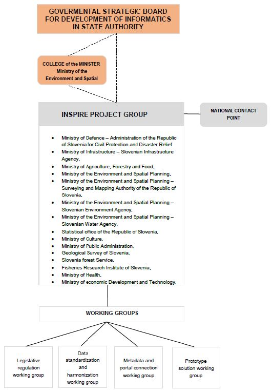

# SI - 2025: Country Fiche

## Table of Contents
1. [Introduction](#introduction)
1. [State of Play](#state_of_play)
   1. [Coordination](#Coordination)
   2. [Functioning and coordination of the infrastructure](#functioning)
   3. [Usage of the infrastructure for spatial information](#usage)
   4. [Data Sharing Arrangements](#data)
   5. [Costs and Benefits](#costs)

## Introduction

The INSPIRE Directive sets the minimum conditions for interoperable sharing and exchange of spatial data across Europe as part of a larger European Interoperability Framework and the e-Government Action Plan that contributes to the Digital Single Market Agenda. Article 21 of [INSPIRE Directive](https://eur-lex.europa.eu/eli/dir/2007/2/oj) defines the basic principles for monitoring and reporting. More detailed implementing rules regarding INSPIRE monitoring and reporting have been adopted as [Commission Implementing Decision (EU) 2019/1372](https://eur-lex.europa.eu/eli/dec_impl/2019/1372/oj) on the 19th August 2019.

This country fiche highlights the progress in the various areas of INSPIRE implementation. It includes information on [Monitoring and Reporting 2024](https://inspire-geoportal.ec.europa.eu/mr/mr2024_details.html?country=si) (data acquired in December 2024) and Member States update.

## State of Play

A high-level view on the governance, use and impact of the INSPIRE Directive in Slovenia. More detailed information is
available on the [INSPIRE knowledge base](https://knowledge-base.inspire.ec.europa.eu/index_en).

### Coordination

#### National Contact Point

- Name of Public Authority: Surveying and Mapping Authority
- Postal Address: Zemljemerska ulica 12, SI-1000 Ljubljana
- Contact Email: matej.sotlar@gov.si
- Telephone Number: +386 1 478 4800
- Telefax Number: /
- National INSPIRE Website: [https://www.e-prostor.gov.si/inspire/](https://www.e-prostor.gov.si/inspire/)
- MIG Contacts: 
  - Contact Person: Matej Sotlar
  - Email: matej.sotlar@gov.si
  - Telephone Number: +386 1 478 4833
- MIG T Contacts: 
  - Contact Person: Matej Sotlar
  - Email: matej.sotlar@gov.si
  - Telephone Number: +386 1 478 4833

#### Coordination Structure & Progress: 

##### Coordination structure

##### Progress

- The annual Slovenian INSPIRE days were organised every year from 2016 to 2022. In 2023 project Green Slovenian Location Framework was launched. In this project we will start to connect all spatial data infrastructures in Slovenia under the name Geo Slovenia. We presented this project at the INSPIRE Conference 2023. In 2024 the first Geo Slovenia Conference was organized and included also INSPIRE themes.
- Several workshops about different INSPIRE related topics for data and services providers and other stakeholders were organised in Slovenia.

### Functioning and coordination of the infrastructure 

- Information available through [Slovenian INSPIRE geoportal](https://www.e-prostor.gov.si/inspire/). In 2023 the [Spatial Geoportal](https://www.e-prostor.gov.si/) was renewed and now includes INSPIRE pages.
- Inclusion of INSPIRE to the broader strategy for managing spatial data and administration processes – eSpatial.
- The principles of the INSPIRE Directive have become an integral part of national strategies for managing spatial data, their use and linking with other national data.
- Slovenian metadata profile was established and [published](https://www.e-prostor.gov.si/fileadmin/user_upload/dokumenti/knjiznicna_gradiva/5827_SMP.pdf). The profile is extended INSPIRE metadata profile.
- Key instructions, recommendations and technical guidelines were translated. Additionally strategic documents were prepared along with education program, which are accessible on the Slovenian INSPIRE geoportal.
- INSPIRE web services are open and freely accessible. In 2021 we added INSPIRE compliant ATOM Feed services.
- In project Green Slovenian Location Framework the INSPIRE data is used and upgraded: the INSPIRE Metadata System and INSPIRE Registry will be upgraded and INSPIRE services will be implemented in the new spatial data infrastructure.

### Usage of the infrastructure for spatial information 

- The public use of spatial data services and spatial data themselves has increased in 2016-2024 as the result of free access to web services, the use is steadilly increasing.
- INSPIRE metadata are regularly harvested to national open data portal.
- A practical example of cross-border cooperation was being carried in the scope of harmonisation of spatial data on the border with Italy (project HARMO-DATA).
- Standardised location data is used for most digital public services in domains such us environment, marine, transport, energy, property/land administrations, spatial planning, smart cities, health, culture, education, utility, tax policy...
- INSPIRE data and services are used to match HVD requirements.

### Data Sharing Arrangements 

- National interoperability framework – NIO is operating as a tool to ease the cooperation inside public administration
- In the time period 2016-2024 no practical examples of performed data sharing agreements between public authorities and European Union institutions and bodies were recorded
- Public Information Access Act has been slightly changed on 8 May 2016 according to the Directive on the re-use of public sector information
- All location data is available free of charge under an open licence without restrictions.

### Costs and Benefits 

- The transparency and opening of data stimulates the efficiency in the public sector and help with the broadening of digital economy and business development.
- Monitoring the advantages and benefits is not systematically regulated.
