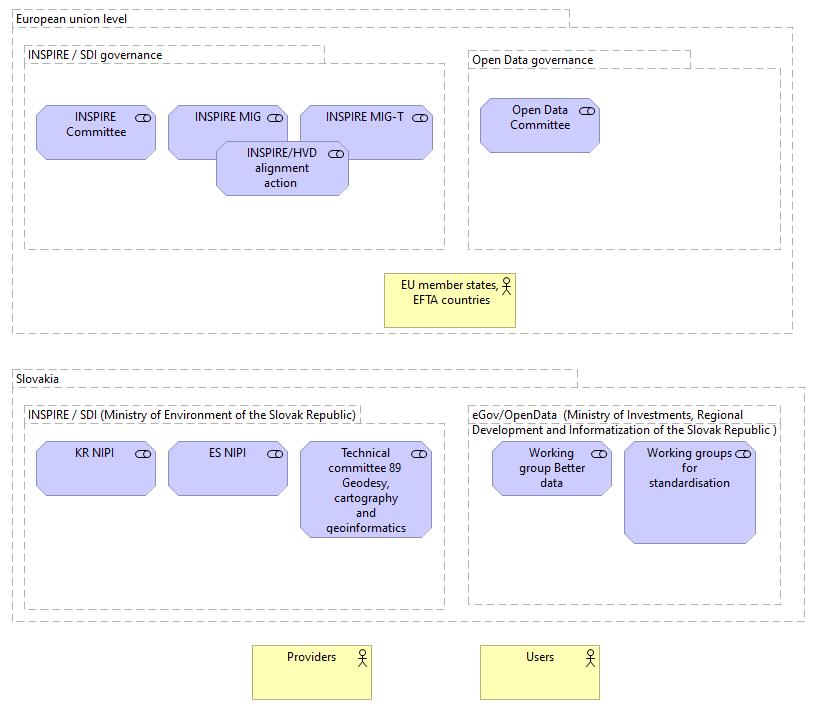
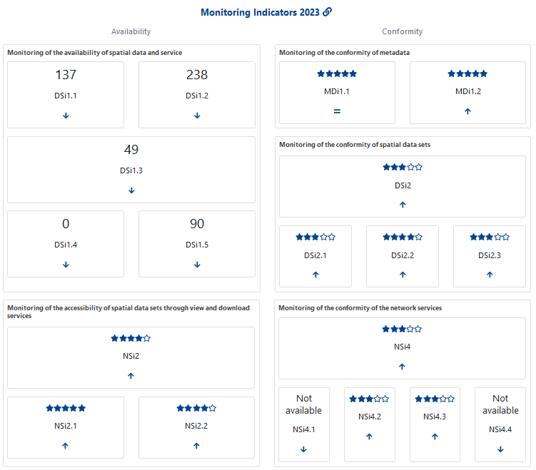
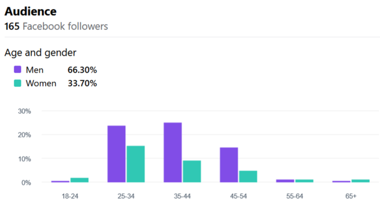

# _SK_ - _2024_: Country Fiche

## Table of Contents
1. [Introduction](#introduction)
1. [State of Play](#state_of_play)
   1. [Coordination](#Coordination)
   2. [Functioning and coordination of the infrastructure](#functioning)
   3. [Usage of the infrastructure for spatial information](#usage)
   4. [Data Sharing Arrangements](#data)
   5. [Costs and Benefits](#costs)

## Introduction

The INSPIRE Directive sets the minimum conditions for interoperable sharing and exchange of spatial data across Europe as part of a larger European Interoperability Framework and the Data Spaces announced by the European
Data Strategy from 20/02/19 and the e-Government Action Plan that contributes to the Shaping of Europe's digital future Digital Single Market Agenda. Article 21 of [INSPIRE Directive](https://eur-lex.europa.eu/eli/dir/2007/2/oj) defines the basic principles for monitoring and reporting. More detailed implementing rules regarding INSPIRE monitoring and reporting have been adopted as [Commission Implementing Decision (EU) 2019/1372](https://eur-lex.europa.eu/eli/dec_impl/2019/1372/oj) on the 19th August 2019.

This country fiche highlights the progress in the various areas of INSPIRE implementation. It includes information on [monitoring 2023](https://inspire-geoportal.ec.europa.eu/catalog/views/inspireportal/monitoringreporting/site/mr2023.html) acquired in December 2023 and Member States update.

## State of Play 

The following paragraphs provide a summary of currently valid information on governance, use, impacts and progress achieved towards INSPIRE implementation.

### Coordination 

#### National Contact Point

- Name of Public Authority: Ministry of Environment of the Slovak Republic 
- Postal Address: Tajovského 28, 975 90 Banská Bystrica, Slovakia
- Contact Email: inspire@enviro.gov.sk
- Telephone Number: +421 48 4374 523
- Telefax Number:
- National INSPIRE Website: https://inspire.gov.sk/
- MIG Contacts: 
  - Contact Person: Martin Tuchyna
  - Email: martin.tuchyna@enviro.gov.sk
  - Telephone Number: +421 48 4374 523
  - Contact Person: Martin Koska
  - Email: martin.koska@enviro.gov.sk
- MIG T Contacts: 
  - Contact Person: Martin Tuchyna
  - Email: martin.tuchyna@enviro.gov.sk
  - Telephone Number: +421 48 4374 523
  - Contact Person: Martin Koska
  - Email: martin.koska@enviro.gov.sk

#### Coordination Structure & Progress: 

##### Coordination structure

Slovakia has transposed the INSPIRE Directive since 2010 by adopting a [Law no. 3/2010 Coll.](https://www.slov-lex.sk/pravne-predpisy/SK/ZZ/2010/3/20160501) about the national infrastructure for spatial information, that was updated in 2016 and 2024. This legal act mandates Ministry of environment of the Slovak republic to coordinate the INSPIRE on national level. In addition [Decree no. 352/2011 Coll.](https://www.slov-lex.sk/pravne-predpisy/SK/ZZ/2011/352/20170201), which implements some provisions of Act no. 3/2010 Z. z. on the national infrastructure for spatial information has been adopted in 2011 and updated in 2017.

Coordination of the relevant stakeholders in Slovakia is facilitated on two main levels:

- Strategy / Main public sector stakeholders’ level represented by Coordination Committee of National Spatial Data Infrastructure [NSDI Council / KR-NIPI](https://inspire.gov.sk/koordinacia/sk/kr-nipi)
- Technical / implementation level represented by [Expert Group of NSDI / ES NIPI](https://inspire.gov.sk/koordinacia/sk/es-nipi)

Based on experience the plan is to merge KR and ES NIPI into the one joint Coordination group (Figure 1.). 

Main responsibility for the INSPIRE implementation and coordination was assigned to the Ministry of Environment of the Slovak Republic (MoE), supported with the Coordination Council (KR NIPI). KR NIPI is representing the main central public authorities, including the representation of local governance.

Ministry of Environment of the Slovak Republic is also in charge of development and maintenance for [National Geoportal](https://geoportal.gov.sk), [Spatial Data Registry](https://rpi.gov.sk)  as well as [National INSPIRE website](https://inspire.gov.sk), communication with the Slovakian stakeholders, communication with European Commission, and provides the primary contacts in both Maintenance and Implementation Groups (MIG) political and technical. 

During the year 2023, coordination with [Open Data / HVD community has continued](https://inspire.gov.sk/koordinacia/sk/opendata-hvd). Main responsibility for the eGov / Open Data agenda remains with Ministry of investment, regional development and informatization of the Slovak Republic (MIRRI) (Figure 1.).

##### Progress

**INSPIRE in Slovakia during the 2023 was mainly focused on update of main infrastructure components, strengthen the availability of INSPIRE resources, alignment with Open Data / High value datasets efforts and improvement of monitoring of the infrastructure**. 

New versions of the National Geoportal, Spatial Data Registry as well as National INSPIRE website were launched during the 2023 in order to support coordination on central level. 

Revision and validation of the INSPIRE resources took place in order to ensure proper linkages and improve performance towards the INSPIRE monitoring.

First joint [INSPIRE and Copernicus Czech and Slovak conference](https://inspirujmese.cz) was organised with intention to create synergies and strengthen knowledge transfer. 

Main challenges remains with the conformity of spatial data sets towards the requirements for interoperability as well as with the conformity of some types of network services. Complexity of the INSPIRE requirements as well as limited capacities on the side of data providers still creates significant limitations. This is remains even more tangible towards the regional and local SDIs.

### Functioning and coordination of the infrastructure 

Coordination of the NSDI during the 2023 took place as via joined NSDI council and NSDI Expert Group meetings, [GitLab collaborative platform](https://gitlab.com/mzpsr/podpora-inspire-implement-cie) as well as via direct communication with the stakeholders.

In connection the results of the INSPIRE monitoring 2023, [there has been substantial increase](https://inspire.gov.sk/clanok/pozitivne-vysledky-inspire-monitroringu-2023-pre-slovensko) in most of the monitored indicators, [thanks to provision of the guidance and support](https://inspire.gov.sk/clanok/testovanie-a-opravy-inspire-prelinkovani) to stakeholders and their commitment.

Although overall amount of metadata records has decreased comparing previous year (via applying the filter selecting only INSPIRE resources) majority of the monitored indicators resulted with increased results.     

Source:[INSPIRE Geoportal](https://inspire-geoportal.ec.europa.eu/catalog/views/inspireportal/monitoringreporting/site/mr2023_details.html?country=sk)  

Comparing the results of [INSPRIE monitoring from 2022](https://inspire-geoportal.ec.europa.eu/catalog/views/inspireportal/monitoringreporting/site/mr2022_details.html?country=sk), the most significant progress has been achieved in the area of services metadata conformance and accessibility of the datasets via view and download services.

Significant improvements are also visible in the area of the conformity for spatial data sets interoperability, as well as conformity of the network services.

### Usage of the infrastructure for spatial information 

Systematic usage monitoring of the infrastructure remains still quite challenge, as there are mainly indirect indicators providing related information. Google analytics statistics related to the INSPIRE related websites for 2023:
-	geoportal.gov.sk:  6,3k users, 74k events;
-	rpi.gov.sk:  529, 6,8k events;
-	inspire.gov.sk:  601 users, 9k events.

Source: [SK INSPIRE Facebook page](https://www.facebook.com/inspiresk)  

Monitoring of the selected INSPIRE services has started initially with the focus on the service availability.

### Data Sharing Arrangements 

Most of the INSPIRE datasets has been made available under the open data licence limiting possible restrictions for the further re-use. Some exceptions remains. 

Adoption of HVD regulation contributed to the further discussion about the geospatial datasets to be made available under Open Data license and in synergy with INSPIRE.

Full integration with SK national Open Data portal is still under the discussion with the Ministry of Investments, Regional Development and Informatization of the Slovak Republic.

### Costs and Benefits 

The cost and benefits evaluation is based on the information collected in the structured tabular information from the representatives of the relevant stakeholders.  

The total indicative costs related with the INSPIRE implementation for 2023:  **340 513 € and 225 person days**. 

From the Benefits perspective, these were identified mainly in for of:
-	Fulfilment of INSPIRE and environmental legal requirements 
-	Strengthening of the discoverability of spatial data 
-	Spatial data accessibility improvement
-	Uniform access to spatial data (priority/harmonized datasets)
-	More efficient management and functionality of internal spatial data and services
-	Increasing pressure on the quality of spatial data and services and their documentation with metadata
-	INSPIRE monitoring results improvements on behalf of the Slovakia
-	Increased potential for digital spatial content and functionality re-use
-	Strengthening communication with external domains and communities
-	Raising awareness of the potential of spatial data and services
-	Synergies strengthen between with Open data and HVD activities
-	Improved availability of spatial data via standardised services  
-	Increased overview and transparency of the spatial data and services managed by Public Health Authority of the Slovak Republic 
-	Increased potential for usability of spatial data for Public Health Authority of the Slovak Republic and other stakeholders
-	Highlighting the need to increase capacity and financial resources to ensure INSPIRE requirements

Detailed information about the costs and benefits can be accessed via this [summary table](https://cms.geocloud.gov.sk/media/tables/INSPIRE_SK_CBA_2022_spolu_draft.xls). Details, based on the information [provided by the organisations](https://cms.geocloud.gov.sk/media/tables/2023_sk_inspire_cba.7z). 
