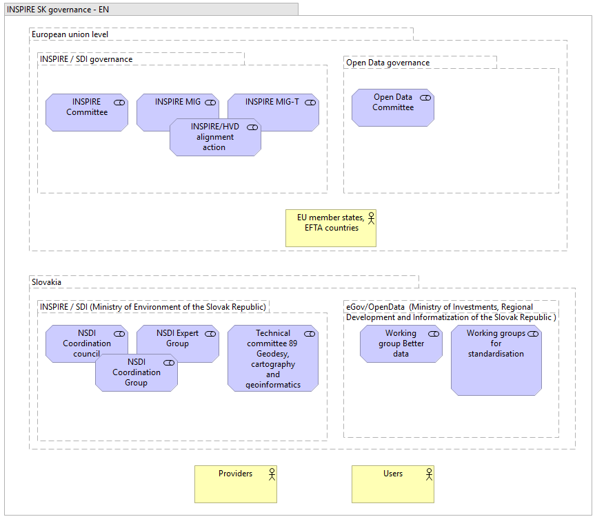
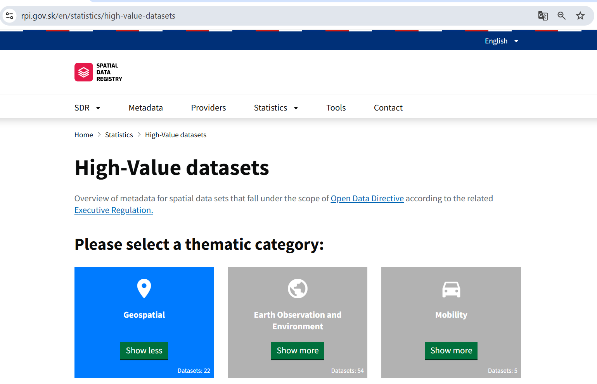
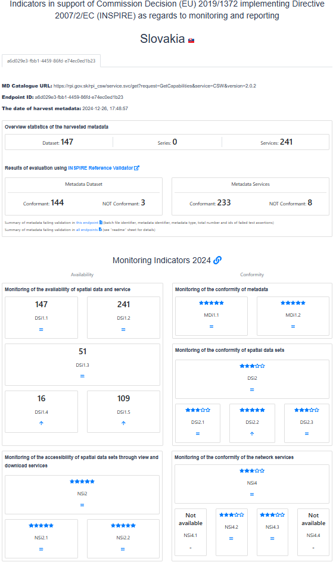
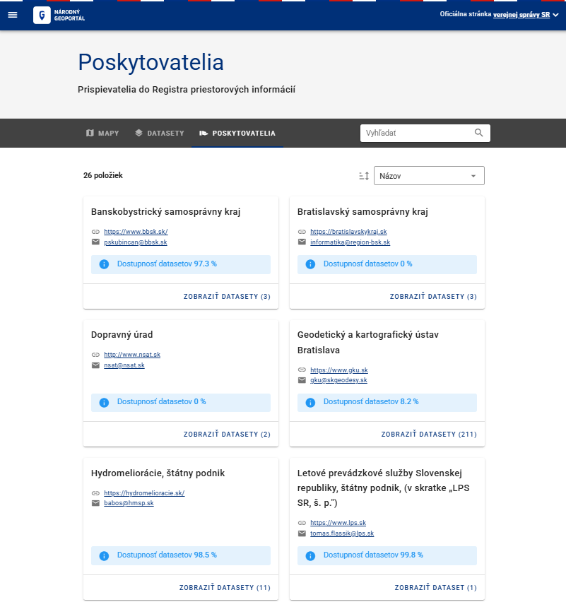
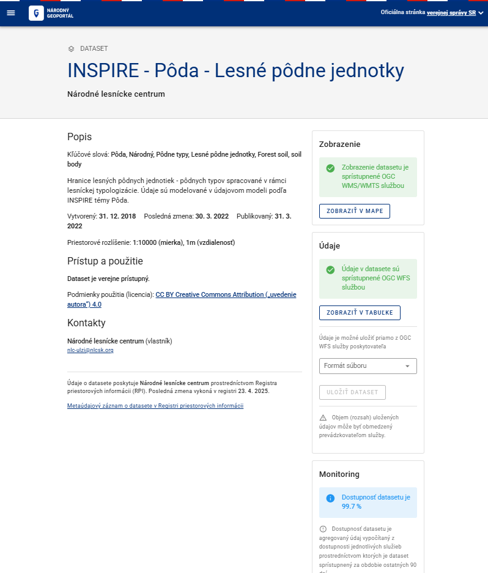

# _SK_ - _2025_: Country Fiche

## Table of Contents
1. [Introduction](#introduction)
1. [State of Play](#state_of_play)
   1. [Coordination](#Coordination)
   2. [Functioning and coordination of the infrastructure](#functioning)
   3. [Usage of the infrastructure for spatial information](#usage)
   4. [Data Sharing Arrangements](#data)
   5. [Costs and Benefits](#costs)

## Introduction

The INSPIRE Directive sets the minimum conditions for interoperable sharing and exchange of spatial data across Europe as part of a larger European Interoperability Framework and the Data Spaces announced by the European
Data Strategy from 20/02/19 and the e-Government Action Plan that contributes to the Shaping of Europe's digital future Digital Single Market Agenda. Article 21 of [INSPIRE Directive](https://eur-lex.europa.eu/eli/dir/2007/2/oj) defines the basic principles for monitoring and reporting. More detailed implementing rules regarding INSPIRE monitoring and reporting have been adopted as [Commission Implementing Decision (EU) 2019/1372](https://eur-lex.europa.eu/eli/dec_impl/2019/1372/oj) on the 19th August 2019.

This country fiche highlights the progress in the various areas of INSPIRE implementation. It includes information on [monitoring 2024](https://inspire-geoportal.ec.europa.eu/catalog/views/inspireportal/monitoringreporting/site/mr2024.html) acquired in December 2024 and Member States' update.

## State of Play 

The following paragraphs provide a summary of currently valid information on governance, use, impacts and progress achieved towards INSPIRE implementation.

### Coordination 

#### National Contact Point

- Name of Public Authority: Ministry of Environment of the Slovak Republic 
- Postal Address: Tajovského 28, 975 90 Banská Bystrica, Slovakia
- Contact Email: inspire@enviro.gov.sk
- Telephone Number: +421 48 4374 523
- National INSPIRE Website: [https://inspire.gov.sk/](https://inspire.gov.sk/)
- MIG Contacts: 
  - Contact Person: Martin Tuchyna
  - Email: martin.tuchyna@enviro.gov.sk
  - Telephone Number: +421 48 4374 523
  - Contact Person: Martin Koska
  - Email: martin.koska@enviro.gov.sk
- MIG T Contacts: 
  - Contact Person: Martin Tuchyna
  - Email: martin.tuchyna@enviro.gov.sk
  - Telephone Number: +421 48 4374 523
  - Contact Person: Martin Koska
  - Email: martin.koska@enviro.gov.sk

#### Coordination Structure & Progress: 

##### Coordination structure

Slovakia has transposed the INSPIRE Directive since 2010 by adopting a [Law no. 3/2010 Coll.](https://www.slov-lex.sk/pravne-predpisy/SK/ZZ/2010/3/20160501) about the national infrastructure for spatial information, that was updated in 2016 and 2024. This legal act mandates the Ministry of Environment of the Slovak republic to coordinate the INSPIRE on national level. In addition [Decree no. 352/2011 Coll.](https://www.slov-lex.sk/pravne-predpisy/SK/ZZ/2011/352/20170201), which implements some provisions of Act no. 3/2010 Z. z. on the national infrastructure for spatial information has been adopted in 2011 and updated in 2017.

Coordination of the relevant stakeholders in Slovakia is facilitated on two main levels:

- Strategy / Main public sector stakeholders’ level represented by the Coordination Committee of National Spatial Data Infrastructure [NSDI Council / KR-NIPI](https://inspire.gov.sk/koordinacia/sk/kr-nipi)
- Technical / implementation level represented by [Expert Group of NSDI / ES NIPI](https://inspire.gov.sk/koordinacia/sk/es-nipi)

Based on experience the plan is to merge KR and ES NIPI into the one joint NSDI Coordination group (Figure 1.). 

Main responsibility for the INSPIRE implementation and coordination was assigned to the Ministry of Environment of the Slovak Republic (MoE), supported with the Coordination Council (KR NIPI). KR NIPI is representing the main central public authorities, including the representation of local governance.

The Ministry of Environment of the Slovak Republic is also in charge of development and maintenance for [National Geoportal](https://geoportal.gov.sk), [Spatial Data Registry](https://rpi.gov.sk)  as well as [National INSPIRE website](https://inspire.gov.sk), communication with the Slovakian stakeholders, communication with European Commission, and provides the primary contacts in both Maintenance and Implementation Groups (MIG) political and technical. 

During the year 2024, coordination with [Open Data / HVD community has continued](https://inspire.gov.sk/koordinacia/sk/opendata-hvd). Main responsibility for the eGov / Open Data agenda remains with Ministry of investment, regional development and informatization of the Slovak Republic (MIRRI) (Figure 1.).

Figure 1: Overview of the Slovakian NSDI coordination

##### Progress

**INSPIRE in Slovakia during the 2024 was mainly focused on the High Value Datasets support**. 

With that in mind relevant EU initiatives were closely followed and coordination with the relevant stakeholders, took place in order to ensure fulfillment of the related legal obligations and practical recommendations. New versions of the Spatial Data Registry (SDR) was launched during the 2024, providing the views on the High Value Datasets (HVD) identified on national level from the National spatial data infrastructure perspective [SK NSDI HVD @ SDR](https://rpi.gov.sk/en/statistics/high-value-datasets).  

Figure 2: SK High value datasets from NSDI

Based on closer coordination with the MIRRI as well as responsible data providers significant amount of HVD was successfully harvested into the [SK National Open Data Portal](https://data.slovensko.sk) as well as to the European Open Data portal [European Open Data portal](https://data.europa.eu/data/datasets?is_hvd=true&locale=en&dataScope=countryData&country=sk&page=1). These results were achieved thanks to the fulfillment of automated integration between [SK NSDI metadata catalogue SDR and SK National Open Data portal](https://inspire.gov.sk/clanok/integracia-nkod-a-rpi).

In order to strenghteen the knowledge transfer and networking [Joint Czech and Slovak INSPIRE and Copernicus conference](https://inspirujmese.eu/sk/archiv-2024) was organised in Slovakia (20. – 21. November 2024). 

Main challenges remains with the conformity of spatial data sets towards the requirements for interoperability as well as with the conformity of some types of network services. Complexity of the INSPIRE requirements as well as limited capacities on the side of data providers still creates significant limitations. This remains even more tangible towards the regional and local SDIs.

### Functioning and coordination of the infrastructure 

Formal coordination of the NSDI during the 2024 was reduced, whilst preparing new simplified coordination framework. Further coordination took place mainly via bilateral interactions and with support of [GitLab collaborative platform](https://gitlab.com/mzpsr/podpora-inspire-implement-cie).

In connection the results of the INSPIRE monitoring 2024, [there has been ensured continuing increase trend](https://inspire.gov.sk/clanok/hodnotenie-stavu-implementacie-inspire-v-eu-i-na-slovensku-za-rok-2024) in most of the monitored indicators, thanks to continuos support to stakeholders and their commitment, including the support from EC INSPIRE Team.

Although most indicators remained stable, an increasing trend was observed in the areas of:

-	Number of metadata for spatial data sets for the national level
-	Number of metadata for spatial data sets for the regional level
-	Compliance with interoperability requirements for spatial data sets for the topics in Annex II of the INSPIRE Directive

The Slovak Republic was also identified as a [country representing examples](https://wikis.ec.europa.eu/download/attachments/152803212/MIG-T81_INSPIRE_Monitoring_Reporting_2024.pdf?version=1&modificationDate=1739525907721&api=v2) of good practice in the areas of:
-	Effective use of the INSPIRE reference validator
-	Overall improvement of indicators in the interannual period 2023-2024

At the same time, areas requiring attention and improvement were identified (e.g. Declaration of compliance with interoperability requirements, simplification of data and service interconnection and metadata reduction, quality of services).

Figure 2: [INSPIRE monitoring indicators 2024 - Slovakia](https://inspire-geoportal.ec.europa.eu/mr/mr2024_details.html?country=sk)  

### Usage of the infrastructure for spatial information 

Systematic NSDI usage monitoring is slowly improving, but obtaining a satisfactory overview remains a challenge.

In 2024 monitoring of the resources in the NSDI was increased with extension of the monitoring and visualisation of the Network services availability via National Geoportal on the level of:
-	[Providers](https://geoportal.gov.sk/gallery/providers) (Figure 3)
-	[Datasets](https://geoportal.gov.sk/gallery/datasets) (Figure 4)  

Figure 3: SK Monitoring of datasets availability on the level of Providers

Figure 4: SK Monitoring of datasets availability on the level of datasets

There are also some indirect indicators providing related information. Google analytics statistics related to the INSPIRE related websites for 2024:
-	geoportal.gov.sk:  0,3k users, 10k events;
-	rpi.gov.sk:  7,1k users, 77k events;
-	inspire.gov.sk:  9,5k users, 231k events.

### Data Sharing Arrangements 

Most of the INSPIRE datasets have been made available under the open data licence limiting possible restrictions for the further re-use. Some exceptions remain. 

Adoption of HVD regulation contributed to the further discussion about the geospatial datasets to be made available under Open Data license and in synergy with INSPIRE.

### Costs and Benefits 

Considering the preparation of the new governance framework, collection of the costs and benefits related information for 2024 will be executed after organising the 1st meeting of SK NSDI Coordination group. Detailed information will be available via this [summary table](https://cms.geocloud.gov.sk/media/tables/INSPIRE_SK_CBA_2024_spolu.xls). 
